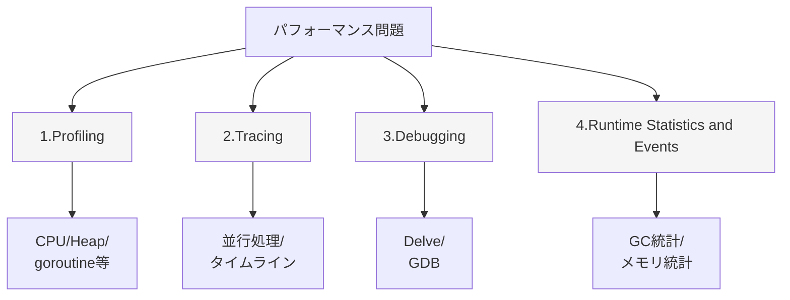
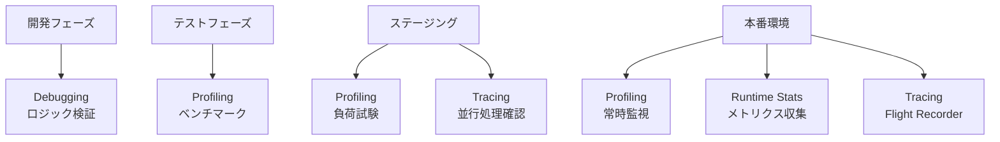
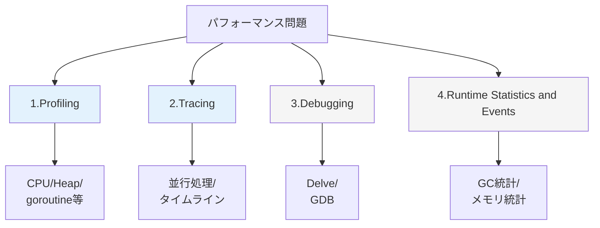

## Goにおける4つの診断方法

Goには、アプリケーションのパフォーマンス問題を診断するための複数のツールが存在しています。例えば、[pprof](https://github.com/google/pprof)、[Execution Tracer](https://go.dev/src/runtime/trace/trace.go)、[Delve](https://github.com/go-delve/delve)などが挙げられます。[Go Wikiの記事](https://go.dev/doc/diagnostics)によると、Go において、これらのツールは以下の4グループに分類できるとされています。



<p align="center"><em>図1: Goにおける4つの診断方法の概要</em></p>

> [!NOTE]
> [公式Wiki](https://go.dev/doc/diagnostics#introduction)によると、一部のツールは相互に干渉する可能性があるため、より正確な情報を得るためにツールを個別に使用することが推奨されています。
> > Note: Some diagnostics tools may interfere with each other. For example, precise memory profiling skews CPU profiles and goroutine blocking profiling affects scheduler trace. Use tools in isolation to get more precise info. 
> >
> > (訳) 一部の診断ツールは互いに干渉する可能性があります。例えば、精度の高いメモリプロファイリングはCPUプロファイルの結果を歪ませ（スキューさせ）、Goroutineのブロッキングプロファイリングはスケジューラのトレースに影響を与えます。より正確な情報を得るためには、ツールを個別に利用してください。
> >
> > 出典: [Diagnostics - The Go Programming Language](https://go.dev/doc/diagnostics#introduction)


## 1. Profiling（プロファイリング）

プロファイリングカテゴリは、 **コード上のホットスポットやコストを特定する**のに役立つツールのカテゴリです。例えば、**CPU 時間の消費量**などを測定することができ、それを元にコード上のコストの高いコードや頻繁に呼び出されるコードセクションを特定することができます。このカテゴリの主要なツールとして、実行中のプログラムからプロファイルデータを収集して可視化する**pprof**があります。

<details>
<summary>ツールや収集できる情報、得意なこと、苦手なこと</summary>

### 収集できる情報

| プロファイル | 測定対象 |
|------------|---------|
| **CPU** | CPU時間の消費 |
| **Heap** | メモリ割り当て |
| **Goroutine** | Goroutineのスタックトレース |
| **Block** | 同期プリミティブでのブロック |
| **Mutex** | Mutexの競合 |
| **Thread** | OSスレッドの生成 |

### 主なツール

- `runtime/pprof` - プログラムに組み込み
- `net/http/pprof` - HTTPエンドポイント経由
- `go tool pprof` - プロファイル分析

### 得意なこと

- ✓ CPU観点でのホットスポットの特定
- ✓ Heap領域におけるメモリリークの検出
- ✓ 関数レベルの最適化
- ✓ 本番環境での継続的監視

### 苦手なこと

- ✗ 時系列での実行状態
- ✗ Goroutine間の関係性
- ✗ GCの詳細なタイミング

</details>


## 2. Tracing（トレース）

トレースカテゴリは、プログラムの一連の呼び出し処理全体における**レイテンシを分析**し、**各コンポーネントの寄与度を特定する**のに役立つツールのカテゴリです。例えば、アプリケーション内や分散システムでの呼び出しコストの測定や、**ランタイムイベント（GC、goroutine、スケジューリングなど）の詳細な動作把握**をすることができます。このカテゴリの主要なツールとして、実行トレースデータを解析し、ブラウザベースのビューアで可視化する**Execution Tracer**があります。

<details>
<summary>関連ツールや収集できる情報、得意なこと、苦手なこと</summary>

### 主なツール

- `runtime/trace` - トレース機能
- `go tool trace` - トレース分析
- [Flight Recorder](https://pkg.go.dev/runtime/trace#FlightRecorder) - 常時記録（**Go 1.25.0以降**）

### 収集できる情報

- Goroutineの生成・実行・ブロック・終了
- チャネル送受信
- Mutex lock/unlock
- GCイベント
- Processor（P）の状態
- User-defined Task/Region/Log

### 得意なこと

- ✓ 並行処理の可視化
- ✓ タイムラインでの状態確認
- ✓ Goroutineリークの詳細調査
- ✓ GCの影響分析
- ✓ **本番環境での継続的使用（Go 1.21+、オーバーヘッド1-2%）**

### 苦手なこと

- ✗ CPU使用率の詳細
- ✗ メモリ使用量の詳細
- △ ファイルサイズ大（ただしFlight Recorderで対処可能）

> [!NOTE]
> **Go 1.21以降でオーバーヘッドが劇的に改善**
> 従来10-20%だったオーバーヘッドが**1-2%に削減**され、本番環境での常時使用が現実的になりました。

</details>

## 3. Debugging（デバッグ）

デバッグカテゴリは、**プログラムを一時停止**し、その**状態とフローを検査**できるようにすることで、プログラムの**動作検証やエラーの原因特定**に役立つツールのカテゴリです。例えば、特定のブレークポイントで実行を停止したり、変数の値を調べたり、コールスタックをたどって関数の呼び出し履歴を確認したりすることができます。このカテゴリの主要なツールとして、Goプログラムのローカルおよびリモートデバッグをサポートするクロスプラットフォームなデバッガの**Delve**があります。


<details>
<summary>関連ツールや収集できる情報、ユースケース</summary>

### 主なツール

- [Delve](https://github.com/go-delve/delve) - Goデバッガ
- GDB - GNU Debugger（限定的サポート）

### 使用例

```bash
# Delveでデバッグ
dlv debug main.go

# ブレークポイント設定
(dlv) break main.processRequest

# 実行
(dlv) continue

# 変数確認
(dlv) print request
```

### ユースケース

- ロジックのバグ調査
- 条件分岐の検証
- データフローの追跡

</details>

## 4. Runtime Statistics and Events

ランタイム統計カテゴリは、Goランタイムに関するデータの集計と分析を通じて、Goプログラムの**健全性と動作に関する高レベルな概要を提供する**のに役立つツールのカテゴリです。例えば、**メモリの割り当て**、**GCの統計**、**goroutineの数**、または**mutexの待機時間**といったメトリクスを収集し、経時的な変化を監視することができます。

このカテゴリのツールとして、メトリクスを収集するための **[runtimeパッケージ](https://pkg.go.dev/runtime)** および **[runtime/metricsパッケージ](https://pkg.go.dev/runtime/metrics)** や、これらのデータを公開するための **[expvarパッケージ](https://pkg.go.dev/expvar)** などがあります。

<details>
<summary>関連機能や収集できる情報、ユースケース</summary>

### 主なツール

- `runtime.MemStats` - メモリ統計
- `runtime.NumGoroutine()` - Goroutine数
- `runtime.ReadMemStats()` - メモリ詳細
- `GODEBUG` - 環境変数による診断

### 収集できる情報

```go
var m runtime.MemStats
runtime.ReadMemStats(&m)

// GC統計
m.NumGC           // GC実行回数
m.PauseTotal      // GC停止時間の合計
m.NextGC          // 次のGCが発動する閾値

// メモリ統計
m.Alloc           // 割り当て済みメモリ
m.TotalAlloc      // 累積割り当て量
m.HeapInuse       // 使用中のヒープ
```

### ユースケース

- メトリクス収集（Prometheus等）
- リアルタイム監視
- アラート設定

</details>

---

## 診断方法の使い分け

### 問題の種類別の選択

| 問題 | 第一選択 | 第二選択 |
|------|---------|---------|
| **CPU使用率が高い** | 1. Profiling (CPU) | - |
| **メモリ使用量が多い** | 1. Profiling (Heap) | 3. Runtime Stats |
| **Goroutineリーク** | 1. Profiling (Goroutine) | 2. Tracing |
| **並行処理が遅い** | 2. Tracing | 1. Profiling (Block/Mutex) |
| **レイテンシにスパイク** | 2. Tracing | 3. Runtime Stats (GC) |
| **ロジックのバグ** | 4. Debugging | - |

### 開発フェーズ別の活用



<p align="center"><em>図2: 開発フェーズ別の診断ツール活用例</em></p>

---

## 本ワークショップの焦点

このワークショップでは、**Profiling と Tracing に焦点をあてます**。




<p align="center"><em>図3: 本ワークショップで扱う診断方法（青色でハイライト）</em></p>

### なぜProfilingとTracingか？

1. **相補的な関係**: ProfilingとTracingは互いに補完し合う
2. **実践的**: 本番環境でも使用頻度が高い
3. **体系的な学習**: 2つを比較することで、各ツールの特性を深く理解できる

---

## 次のステップ

それでは、ProfilingとTracingの詳細を学んでいきましょう。

- **Part 1**: [Profilingの基礎]() - CPU、Heap、Goroutine、Block、Mutexプロファイリング
- **Part 2**: [Traceの基礎]() - タイムライン可視化、Task/Region、Flight Recorder

---

## 参考資料

- [Diagnostics - The Go Programming Language](https://go.dev/doc/diagnostics)
- [Go Performance Tuning](https://goperf.dev/)
- [Effective Go - Diagnostics](https://go.dev/doc/effective_go#debugging)
