## CPU Profilingとは

CPU Profilingは、プログラムがCPU時間をどこで消費しているかを特定するための手法です。スリープやI/O待機ではなく、**実際にCPUを使用している処理**を測定します。

---

## CPU Profilingの仕組み

### サンプリングベースの測定

CPU Profilingは**サンプリングベース**で動作します。つまり、一定間隔でプログラムの実行状態をスナップショットとして記録します。


### 主要な仕組み

1. **SIGPROF による割り込み**
   - デフォルトで100Hz（10ms間隔）でSIGPROFシグナルが発行される
   - カーネルがプログラムの実行を一時停止し、CPU状態を保存

2. **スタックトレースの取得**
   - プログラムカウンタ（PC）、スタックポインタ（SP）を記録
   - 現在実行中の関数とその呼び出し元をトレース

3. **非同期記録**
   - 取得したスタックトレースを`profBuf`（ロックフリーリングバッファ）へ書き込み
   - バックグラウンドで集約・マージ処理

4. **Protocol Buffer 形式で保存**
   - 停止時に集約されたデータをpprof形式（Protocol Buffer）で出力

```mermaid
graph TB
      subgraph INIT["📌 初期化フェーズ (1回のみ)"]
          START[pprof.StartCPUProfile]
          SET_RATE[SetCPUProfileRate: 100Hz]
          INIT_BUF[profBuf 初期化]
          SETITIMER[setitimer システムコール]
          TIMER_START[ITIMER_PROF タイマー開始]

          START --> SET_RATE --> INIT_BUF --> SETITIMER
          SETITIMER -.->|カーネルへ| TIMER_START
      end

      subgraph SAMPLING["🔄 サンプリングループ (100Hz で繰り返し)"]
          subgraph USER_EXEC["ユーザランド: アプリケーション実行"]
              APP_RUN[アプリケーション実行中<br/>例: 関数 A, B, C...]
          end

          subgraph KERNEL_INTERRUPT["カーネルランド: タイマー割り込み"]
              TIMER_WAIT[ITIMER_PROF 待機<br/>10ms カウント中...]
              TIMER_EXPIRE[⏰ タイマー満了<br/>10ms 経過]
              SIGPROF_GEN[SIGPROF シグナル生成]
              SAVE_CTX[CPU レジスタ保存<br/>RIP, RSP, RBP...]
              BUILD_UCTX[ucontext 構築]
              PUSH_STACK[ユーザスタックへプッシュ]
              SET_RIP[RIP = sigtramp アドレス]
              RETURN_USER[iretq: ユーザランドへ復帰]
          end

          subgraph SIGNAL_HANDLE["ユーザランド: シグナルハンドラ"]
              SIGTRAMP[🎯 sigtramp 実行開始<br/>sys_linux_amd64.s:335]
              SIGTRAMPGO[sigtrampgo<br/>シグナル振り分け]
              SIGHANDLER[sighandler<br/>SIGPROF 処理]
              SIGPROF[sigprof<br/>ucontext から抽出:<br/>PC, SP, LR]
              UNWIND[スタックアンワインド<br/>例:関数C->関数B->main]
              CPUPROF_ADD[⭐ cpuprof.add<br/>profBuf へ書き込み<br/>cpuprof.go:146]
              HANDLER_END[シグナルハンドラ終了]
              RESUME[中断点へ復帰]
          end

          APP_RUN --> TIMER_WAIT
          TIMER_WAIT --> TIMER_EXPIRE
          TIMER_EXPIRE --> SIGPROF_GEN
          SIGPROF_GEN --> SAVE_CTX
          SAVE_CTX --> BUILD_UCTX
          BUILD_UCTX --> PUSH_STACK
          PUSH_STACK --> SET_RIP
          SET_RIP --> RETURN_USER
          RETURN_USER -.->|復帰| SIGTRAMP

          SIGTRAMP --> SIGTRAMPGO
          SIGTRAMPGO --> SIGHANDLER
          SIGHANDLER --> SIGPROF
          SIGPROF --> UNWIND
          UNWIND --> CPUPROF_ADD
          CPUPROF_ADD --> HANDLER_END
          HANDLER_END --> RESUME
          RESUME -->|処理再開| APP_RUN
      end

      subgraph BUFFER["profBuf (リングバッファ) - 継続的蓄積"]
          PROFBUF_DATA["📊 蓄積されたスタックトレース<br/>━━━━━━━━━━━━━━━━<br/>サンプル #1: [関数A, main]<br/>サンプル #2: [関数B, main]<br/>サンプル #3: [関数C, 関数B, main]<br/>サンプル #4: [関数B, main]<br/>サンプル #5: [関数D, main]<br/>...<br/>サンプル #100: [関数B, main]"]
      end

      subgraph ASYNC["⚡ 非同期処理 (別ゴルーチン)"]
          READER[定期的読み取り<br/>pprof.go:454]
          MERGE[スタックマージ・集約<br/>同じスタック → カウント増加]
          AGGREGATE["集約結果<br/>━━━━━━━━━━<br/>関数B: 35回 (35%)<br/>関数A: 20回 (20%)<br/>関数C: 15回 (15%)<br/>..."]
      end

      subgraph FINAL["📌 終了フェーズ"]
          STOP[pprof.StopCPUProfile]
          TIMER_STOP[タイマー停止]
          SERIALIZE[Protocol Buffer<br/>シリアライゼーション]
          OUTPUT[ファイル出力<br/>cpu.prof]
      end

      TIMER_START --> APP_RUN
      CPUPROF_ADD -.->|書き込み| PROFBUF_DATA
      PROFBUF_DATA -.->|読み取り| READER
      READER --> MERGE
      MERGE --> AGGREGATE

      AGGREGATE --> STOP
      STOP --> TIMER_STOP
      TIMER_STOP --> SERIALIZE
      SERIALIZE --> OUTPUT

      %% ループバック: 継続的実行を表現
      RESUME ==>|🔄 10ms 後に再度割り込み<br/>このサイクルが 100Hz で繰り返される| TIMER_WAIT

      style INIT fill:#e3f2fd,stroke:#1565c0,stroke-width:2px
      style SAMPLING fill:#fff9c4,stroke:#f57f17,stroke-width:3px
      style KERNEL_INTERRUPT fill:#ffccbc,stroke:#bf360c,stroke-width:2px
      style SIGNAL_HANDLE fill:#c8e6c9,stroke:#2e7d32,stroke-width:2px
      style USER_EXEC fill:#f3e5f5,stroke:#6a1b9a,stroke-width:2px
      style BUFFER fill:#e0f2f1,stroke:#00695c,stroke-width:2px
      style ASYNC fill:#fff3e0,stroke:#e65100,stroke-width:2px
      style FINAL fill:#fce4ec,stroke:#c2185b,stroke-width:2px

      style TIMER_EXPIRE fill:#ff6b6b,stroke:#c92a2a,stroke-width:2px
      style SIGTRAMP fill:#51cf66,stroke:#2b8a3e,stroke-width:2px
      style CPUPROF_ADD fill:#ffd43b,stroke:#f59f00,stroke-width:3px
      style RESUME fill:#74c0fc,stroke:#1864ab,stroke-width:2px
      style PROFBUF_DATA fill:#96f2d7,stroke:#087f5b,stroke-width:2px
```

<details>
<summary>SIGPROFシグナルによる割り込みの詳細な振る舞い</summary>



</details>

---

## 演習: CPU Profilingの実践

### 演習の目的

大量のテキストデータを処理するプログラムを題材に、CPU Profilingを使ってボトルネックを特定し、最適化します。

演習ディレクトリ: `exercises/profiling/01-cpu/`

### 問題の概要

このプログラムには以下の非効率な実装が含まれています：

1. 文字列連結を `+=` で実行（O(n²)の計算量）
2. 正規表現を毎回コンパイル
3. 不要な文字列変換

---

## 演習手順

### ステップ1: プロファイルの取得

```bash
cd exercises/profiling/01-cpu/

# CPU プロファイルを取得
go run main.go -cpuprofile=cpu.prof
```

実行すると、`cpu.prof`ファイルが生成されます。

### ステップ2: Webビューアで分析

```bash
go tool pprof -http=:8080 cpu.prof
```

ブラウザが自動的に開き、以下のビューが利用できます：

#### Flame Graph（フレームグラフ）

**見方**:
- **横幅が広いほど、その関数が多くのCPU時間を消費**
- 上下関係は呼び出し階層を表す（下が呼び出し元、上が呼び出し先）
- クリックでその関数にズームイン

**この演習での確認ポイント**:
- `buildText`関数が横に広い台地状になっている → この関数自体が重い（flat値が大きい）
- `regexp.MustCompile`が複数の細い棒として現れる → 繰り返し呼ばれている

**典型的な出力例**:
```
main.buildText (幅広い台地)
├──────────────────────────────┤ 50% のCPU時間を消費

main.process (細長い山)
│  ┌──────┐
│  │regexp│  ← 呼び出し先のregexp.MustCompileが重い
└──┴──────┘
```

#### Graph（コールグラフ）

**見方**:
- **ノードのサイズと色**: flat値に比例（大きく・赤いほど重い）
- **エッジ（矢印）の太さ**: 呼び出し回数やコストに比例
- **ノード内の数値**:
  ```
  関数名
  flat値 (flat%)      ← この関数自体のCPU時間
  of cum値 (cum%)     ← 呼び出し先を含む合計CPU時間
  ```

**色の意味**:
- **赤**: 重大なボトルネック（flat% > 10%）
- **オレンジ**: 中程度のボトルネック（flat% 5-10%）
- **グレー**: 軽い処理（flat% < 5%）

**この演習での確認ポイント**:
- `main.buildText`が赤く大きく表示される → 最適化すべき関数
- `regexp.MustCompile`へのエッジが太い → 頻繁に呼び出されている

**操作**:
- ノードをクリック → 詳細情報を表示
- ノードをダブルクリック → その関数を起点に再表示
- `VIEW` → `Focus` → `buildText` → `buildText`関数周辺のみ表示

#### Top（関数ごとの統計）

```
Showing nodes accounting for 1.5s, 95% of 1.58s total
      flat  flat%   sum%        cum   cum%
     0.8s 50.63% 50.63%      1.2s 75.95%  main.buildText
     0.3s 18.99% 69.62%      0.5s 31.65%  regexp.MustCompile
     0.2s 12.66% 82.28%      0.2s 12.66%  strings.(*Builder).WriteString
```

**各列の詳細な意味**:
- **flat** (0.8s): `main.buildText`「自身」で消費したCPU時間（自己コスト）
- **flat%** (50.63%): 全体のCPU時間の50.63%をこの関数自体が消費
- **sum%** (50.63%): 上位からの累積割合（この行までで全体の50.63%）
- **cum** (1.2s): `main.buildText`が呼ばれている間に消費された合計CPU時間（累積コスト）
- **cum%** (75.95%): 全体のCPU時間の75.95%がこの関数を起点とした処理で消費

**分析のポイント**:
- **`main.buildText`**: flat% 50.63% → **この関数の中身自体が非常に重い**
  - flat (0.8s) ≈ cum (1.2s) なので、ほとんどの時間を関数内で消費
  - 差分の0.4s (1.2s - 0.8s) が呼び出し先のコスト
  - 👉 この関数自体を最適化すべき（即効性あり）
- **`regexp.MustCompile`**: flat% 18.99% → この関数も重い
  - flat = cum なので、子関数を呼んでいない末端の重い関数
  - 👉 呼び出し回数を減らす（ループ外に出す）
- **sum% 82.28%**: 上位3関数で全体の82%を占める
  - 👉 パレートの法則: この3つを最適化すれば大きな効果

**値の判断基準**:
- **flat% 50%**: 異常に大きい → 最優先で最適化
- **flat% 10-20%**: 大きい → 最適化の価値あり
- **sum% 80%**: パレートの法則 → ここまでの関数群に集中

**flat と cum の関係から読み解く**:
- **flat ≈ cum**: 末端の重い関数（最優先で最適化）
- **flat << cum**: 呼び出し先が重い（call graphをたどる）
- **flat が大きい**: 関数の中身を改善（アルゴリズム、ループ削減）

### ステップ3: CLIモードでの分析

```bash
go tool pprof cpu.prof
```

対話モードで以下のコマンドを実行：

```
(pprof) top10
(pprof) list buildText
(pprof) web
```

`list`コマンドで、ソースコードの各行がどれだけCPU時間を消費しているかを確認できます。

### ステップ4: 問題の特定

分析結果から以下の問題が明らかになります：

1. **文字列連結のボトルネック**
   - `buildText`関数での `+=` による文字列連結が遅い
   - 毎回新しいメモリ割り当てが発生

2. **正規表現の重複コンパイル**
   - `regexp.MustCompile`がループ内で繰り返し実行される
   - 一度コンパイルすれば再利用可能

3. **不要な文字列変換**
   - 必要以上の型変換が行われている

---

## 改善方法

### 改善1: strings.Builder の使用

```go
// Before (O(n²))
func buildText() string {
    result := ""
    for i := 0; i < 10000; i++ {
        result += "word "  // 毎回メモリ再割り当て
    }
    return result
}

// After (O(n))
func buildText() string {
    var builder strings.Builder
    builder.Grow(50000)  // 事前にメモリ確保
    for i := 0; i < 10000; i++ {
        builder.WriteString("word ")
    }
    return builder.String()
}
```

### 改善2: 正規表現の事前コンパイル

```go
// Before
func process(text string) {
    for _, line := range strings.Split(text, "\n") {
        re := regexp.MustCompile(`\w+`)  // 毎回コンパイル
        matches := re.FindAllString(line, -1)
        // ...
    }
}

// After
var wordRegex = regexp.MustCompile(`\w+`)  // 1回だけコンパイル

func process(text string) {
    for _, line := range strings.Split(text, "\n") {
        matches := wordRegex.FindAllString(line, -1)
        // ...
    }
}
```

---

## 改善版の検証

### ステップ5: 改善版のプロファイル取得

```bash
go run main_fixed.go -cpuprofile=cpu_fixed.prof
```

### ステップ6: Before/After 比較

```bash
# ベースラインとの差分を表示
go tool pprof -http=:8080 -base=cpu.prof cpu_fixed.prof
```

このコマンドで、改善前後の差分が可視化されます。赤いノードは改善された部分を示します。

### ステップ7: ベンチマークでの定量評価

```bash
# 問題版
go test -bench=BenchmarkBuildText -benchmem

# 改善版
go test -bench=BenchmarkBuildTextFixed -benchmem
```

期待される改善:
- 実行時間: **約10-20倍高速化**
- メモリアロケーション: **約1/100に削減**

---

## go tool pprof の主要コマンド

### インタラクティブモードのコマンド

| コマンド | 説明 |
|---------|------|
| `top` | 上位N個の関数を表示 |
| `top10 -cum` | 累積時間でトップ10を表示 |
| `list <func>` | 関数のソースコードと行ごとの統計 |
| `web` | グラフをブラウザで表示 |
| `pdf` | PDFとして出力 |
| `png` | PNGとして出力 |
| `peek <func>` | 関数の呼び出し元と呼び出し先を表示 |

### Webビューアのビュー

| ビュー | 用途 |
|--------|------|
| **Graph** | コールグラフでボトルネックを特定 |
| **Flame Graph** | 直感的にCPU時間の消費を可視化 |
| **Peek** | 特定の関数の呼び出し関係を詳細表示 |
| **Source** | ソースコードと統計を並べて表示 |
| **Top** | 関数ごとの統計をテーブル表示 |

---

## まとめ

CPU Profilingを使うことで：

1. **ボトルネックの特定**: どの関数がCPU時間を消費しているかを定量的に把握
2. **改善効果の測定**: 最適化前後の比較で改善効果を検証
3. **データドリブンな最適化**: 憶測ではなく実測データに基づいた改善

次は[Heap Profiling]()でメモリ使用状況を分析します。
