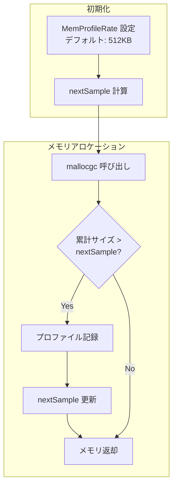

## Heap Profilingとは

Heap Profilingは、プログラムのメモリ割り当て状況を分析するための手法です。メモリリークの検出や、過剰なアロケーションの特定に使用します。

---

## Heap Profilingの仕組み

### サンプリングベースのメモリ測定

Heap Profilingも**サンプリングベース**で動作します。全てのアロケーションを記録するのではなく、一定量ごとにサンプリングします。



### 主要な仕組み

1. **サンプリングレート**
   - デフォルト: 512KB ごとに1回サンプリング
   - `runtime.MemProfileRate`で調整可能

2. **記録されるデータ**
   - アロケーション発生箇所（スタックトレース）
   - 割り当てサイズ
   - 割り当て回数

3. **inuse vs alloc**
   - **inuse**: 現在使用中のメモリ（GC後も残っているもの）
   - **alloc**: 累積アロケーション量（GCで回収されたものも含む）

---

## 演習: Heap Profilingの実践

### 演習の目的

JSONデータを処理するプログラムを題材に、Heap Profilingを使ってメモリの無駄遣いを特定し、最適化します。

演習ディレクトリ: `exercises/profiling/02-heap/`

### 問題の概要

このプログラムには以下のメモリ問題が含まれています：

1. スライスの容量を事前確保していない（頻繁な再アロケーション）
2. 不要な `[]byte` から `string` への変換
3. `sync.Pool` を使わずに毎回バッファを新規作成

---

## 演習手順

### ステップ1: プロファイルの取得

```bash
cd exercises/profiling/02-heap/

# メモリプロファイルを取得
go run main.go -memprofile=mem.prof
```

実行すると、`mem.prof`ファイルが生成されます。

### ステップ2: Webビューアで分析

```bash
go tool pprof -http=:8080 mem.prof
```

#### SAMPLE の種類を理解する

Webビューアの上部にある **SAMPLE** ドロップダウンで、以下の4つの指標を切り替えられます：

| 指標 | 意味 | 用途 | どの値が大きいとき |
|------|------|------|-------------------|
| **inuse_space** | 現在使用中のメモリ量 | メモリリークの検出 | 大きい → メモリが解放されていない（リーク疑い） |
| **inuse_objects** | 現在使用中のオブジェクト数 | オブジェクトリークの検出 | 大きい → オブジェクトが蓄積されている |
| **alloc_space** | 累積アロケーション量 | **GC負荷の分析（重要）** | 大きい → GCの負荷が高い（頻繁にメモリ確保） |
| **alloc_objects** | 累積アロケーション回数 | アロケーション頻度の分析 | 大きい → アロケーション回数が多い（要最適化） |

**重要**: GC負荷を下げるには、`alloc_space`を確認することが重要です。

**使い分けの指針**:
- **メモリリークの調査**: `inuse_space` → 時間経過で増加し続ける関数を特定
- **パフォーマンス改善**: `alloc_space` → GCの負荷となるアロケーションを削減
- **オブジェクト数の最適化**: `alloc_objects` → 小さなオブジェクトの大量生成を検出
- **現在のメモリ状態**: `inuse_objects` → どのオブジェクトが保持されているか

**各指標の典型的な値の意味**:

`alloc_space`（累積アロケーション量）:
- **100MB以上/秒**: 非常に高いGC負荷 → 早急に最適化が必要
- **10-100MB/秒**: 高いGC負荷 → 最適化を検討
- **1-10MB/秒**: 中程度のGC負荷 → パフォーマンス要件次第
- **1MB未満/秒**: 低いGC負荷 → 問題なし

`inuse_space`（現在使用中のメモリ）:
- **時間経過で増加**: メモリリークの可能性
- **安定している**: 正常
- **定期的に減少**: GCが正常に動作

**例: alloc_space vs inuse_space の違い**:
```go
// プログラム実行中に以下を繰り返す
for i := 0; i < 1000000; i++ {
    data := make([]byte, 1024)  // 1KB確保
    process(data)
    // data はここでスコープを外れる
}

// alloc_space: 約1GB（累積で確保した総量）
// inuse_space: 数MB程度（GCで回収されるため少ない）
// → alloc_spaceが大きいとGC負荷が高い
```

### ステップ3: alloc_space での分析

```bash
# Webビューアで SAMPLE → alloc_space を選択
```

Flame Graphで以下を確認：
- `processData`関数が大量のメモリを確保
- `append`による再アロケーションが頻繁に発生

### ステップ4: CLIモードでの分析

```bash
go tool pprof mem.prof
```

対話モードで以下のコマンドを実行：

```
(pprof) sample_index = alloc_space
(pprof) top10
(pprof) list processData
```

`list`コマンドで、ソースコードのどの行でメモリアロケーションが発生しているかを確認できます。

### ステップ5: 問題の特定

分析結果から以下の問題が明らかになります：

1. **スライスの再アロケーション**
   - 容量を指定せずに`append`を使用
   - スライスが拡張されるたびにメモリコピーが発生

2. **不要な型変換**
   - `[]byte`から`string`への変換で新しいメモリが確保される
   - 変換が必要ない場面で行われている

3. **バッファの使い捨て**
   - 毎回新しいバッファを作成
   - `sync.Pool`で再利用可能

---

## 改善方法

### 改善1: スライスの事前容量確保

```go
// Before
func processData(n int) []Data {
    result := []Data{}  // 容量0で開始
    for i := 0; i < n; i++ {
        result = append(result, Data{ID: i})  // 再アロケーション頻発
    }
    return result
}

// After
func processData(n int) []Data {
    result := make([]Data, 0, n)  // 事前に容量確保
    for i := 0; i < n; i++ {
        result = append(result, Data{ID: i})  // 再アロケーションなし
    }
    return result
}
```

### 改善2: 不要な型変換の削除

```go
// Before
func process(data []byte) {
    str := string(data)  // 新しいメモリ確保
    if str == "target" {
        // ...
    }
}

// After
func process(data []byte) {
    if bytes.Equal(data, []byte("target")) {  // 変換なし
        // ...
    }
}
```

### 改善3: sync.Pool の活用

```go
// Before
func encode(data Data) []byte {
    buf := new(bytes.Buffer)  // 毎回新規作成
    json.NewEncoder(buf).Encode(data)
    return buf.Bytes()
}

// After
var bufferPool = sync.Pool{
    New: func() interface{} {
        return new(bytes.Buffer)
    },
}

func encode(data Data) []byte {
    buf := bufferPool.Get().(*bytes.Buffer)  // プールから取得
    defer func() {
        buf.Reset()
        bufferPool.Put(buf)  // プールに返却
    }()
    json.NewEncoder(buf).Encode(data)
    return buf.Bytes()
}
```

---

## 改善版の検証

### ステップ6: 改善版のプロファイル取得

```bash
go run main_fixed.go -memprofile=mem_fixed.prof
```

### ステップ7: Before/After 比較

```bash
# ベースラインとの差分を表示
go tool pprof -http=:8080 -base=mem.prof mem_fixed.prof
```

### ステップ8: ベンチマークでの定量評価

```bash
# 問題版
go test -bench=BenchmarkProcessData -benchmem

# 改善版
go test -bench=BenchmarkProcessDataFixed -benchmem
```

出力例：
```
BenchmarkProcessData-8              1000    1200000 ns/op   500000 B/op   1000 allocs/op
BenchmarkProcessDataFixed-8        10000     120000 ns/op   100000 B/op    100 allocs/op
```

期待される改善:
- メモリアロケーション回数: **約1/10に削減**
- アロケーション量: **約1/5に削減**
- GCの負荷軽減

---

## inuse vs alloc の使い分け

### inuse_space を使うべき場合

- **メモリリークの検出**
  - 時間経過とともにinuse_spaceが増加し続ける場合、リークの可能性
  - 定期的にプロファイルを取得して比較

```bash
# 10分後に再度取得
go tool pprof -http=:8080 -base=mem_old.prof mem_new.prof
```

- **長時間保持されるデータの分析**
  - キャッシュやグローバル変数など

### alloc_space を使うべき場合

- **GC負荷の分析**
  - 頻繁に作成・破棄されるオブジェクトを特定
  - GCのオーバーヘッドを削減

- **パフォーマンスチューニング**
  - 不要なアロケーションを削減
  - `sync.Pool`の活用を検討

---

## Heap Profiling の実践的なTips

### 1. ベンチマークでの自動取得

```bash
go test -bench=. -memprofile=mem.prof -benchmem
```

### 2. net/http/pprof での取得

```bash
# 現在のヒープスナップショット
curl http://localhost:6060/debug/pprof/heap > heap.prof

# go tool pprof で分析
go tool pprof heap.prof
```

### 3. alloc_objects での頻度確認

```bash
go tool pprof -sample_index=alloc_objects mem.prof
```

アロケーション回数が多い箇所を特定し、まとめて確保できないか検討します。

---

## まとめ

Heap Profilingを使うことで：

1. **メモリリークの早期発見**: inuse_spaceの推移を監視
2. **GC負荷の軽減**: alloc_spaceを削減することでGCの頻度を下げる
3. **メモリ効率の改善**: 不要なアロケーションを特定して最適化

次は[Goroutine Profiling]()でgoroutineリークを検出します。
