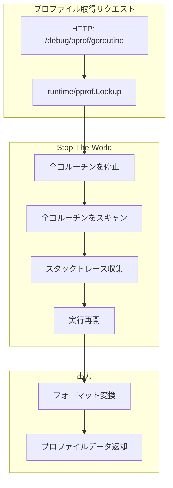

## Goroutine Profilingとは

Goroutine Profilingは、現在実行中の全てのgoroutineのスタックトレースを取得し、goroutineリークやデッドロックを検出するための手法です。

---

## Goroutine Profilingの仕組み

### STWによるスナップショット

Goroutine Profilingは、STW（Stop-The-World）を発生させてgoroutineのスナップショットを取得します。



### 主要な仕組み

1. **STWの発生**
   - goroutineプロファイル取得時に一時的にSTW
   - 全goroutineの実行を停止

2. **スタックトレースの収集**
   - 各goroutineの状態（running, waiting, etc.）
   - スタックトレース（どこで何を待っているか）

3. **出力フォーマット**
   - テキスト形式（`?debug=1`）
   - pprof形式（バイナリ）

---

## 演習: Goroutine Profilingの実践

### 演習の目的

ワーカープールパターンを実装したプログラムを題材に、Goroutine Profilingを使ってgoroutineリークを検出し、修正します。

演習ディレクトリ: `exercises/profiling/03-goroutine/`

### 問題の概要

このプログラムには以下のgoroutineリークが含まれています：

1. チャネルを`close`していない（ワーカーが永遠に待機）
2. contextのキャンセルが伝播していない
3. エラー時にgoroutineが残る

---

## 演習手順

### ステップ1: サーバーの起動

```bash
cd exercises/profiling/03-goroutine/

# HTTPサーバーとして起動
go run main.go
```

プログラムはポート6060でHTTPサーバーを起動し、`net/http/pprof`を有効にしています。

### ステップ2: Goroutineプロファイルの取得

#### テキスト形式で取得

```bash
# 別のターミナルで実行
curl http://localhost:6060/debug/pprof/goroutine?debug=1 > goroutine.txt

# 内容を確認
head -20 goroutine.txt
```

出力例：
```
goroutine profile: total 1523
1500 @ 0x43e7e5 0x43e8b6 0x463cc5 0x48c3c5 0x48c346 0x46de01
#	0x463cc4	main.worker+0x64	/path/to/main.go:45

20 @ 0x43e7e5 0x40a4f6 0x40a4d5 0x43e8b6 0x463cc5 0x463d05 0x46de01
#	0x463cc4	main.producer+0x84	/path/to/main.go:60
```

- `total 1523`: 合計1523個のgoroutineが存在
- `1500 @`: 同じスタックトレースを持つgoroutineが1500個

**これはリークの兆候です！**

#### pprof形式で取得・分析

```bash
go tool pprof http://localhost:6060/debug/pprof/goroutine
```

対話モードで：
```
(pprof) top
(pprof) list worker
```

### ステップ3: Webビューアでの分析

```bash
go tool pprof -http=:8080 http://localhost:6060/debug/pprof/goroutine
```

#### Graph ビュー

- `worker`関数が大量のgoroutineを生成
- ノードの数字がgoroutine数を表す

#### Top ビュー

```
Showing nodes accounting for 1500, 98.5% of 1523 total
      flat  flat%   sum%        cum   cum%
      1500 98.5% 98.5%       1500 98.5%  main.worker
        20  1.3% 99.8%         20  1.3%  main.producer
```

- `worker`関数で1500個のgoroutineがブロック

### ステップ4: 問題の特定

#### リークの原因を特定

```bash
go tool pprof goroutine.txt
```

```
(pprof) list worker
```

出力例：
```go
     40:func worker(ch <-chan Task) {
     41:    for task := range ch {  // チャネルが close されないと永遠にループ
     42:        task.Process()
     43:    }
     44:}  // ここに到達しない
```

**問題**:
1. `ch`が`close`されないため、`for range`が終了しない
2. workerがチャネル受信で永遠にブロック
3. contextのキャンセルが伝播していない

---

## 改善方法

### 改善1: チャネルの適切なクローズ

```go
// Before
func startWorkers(n int, ch chan Task) {
    for i := 0; i < n; i++ {
        go worker(ch)
    }
    // チャネルを close していない
}

// After
func startWorkers(ctx context.Context, n int, ch chan Task) {
    var wg sync.WaitGroup
    for i := 0; i < n; i++ {
        wg.Add(1)
        go func() {
            defer wg.Done()
            worker(ctx, ch)
        }()
    }

    // 全タスク送信後にクローズ
    go func() {
        <-ctx.Done()
        close(ch)
        wg.Wait()
    }()
}
```

### 改善2: Contextによるキャンセル伝播

```go
// Before
func worker(ch <-chan Task) {
    for task := range ch {
        task.Process()
    }
}

// After
func worker(ctx context.Context, ch <-chan Task) {
    for {
        select {
        case task, ok := <-ch:
            if !ok {
                return  // チャネルがクローズされたら終了
            }
            task.Process()
        case <-ctx.Done():
            return  // キャンセルされたら終了
        }
    }
}
```

### 改善3: sync.WaitGroupでの待機

```go
// Before
func main() {
    ch := make(chan Task)
    startWorkers(10, ch)

    // workerの終了を待たない
}

// After
func main() {
    ctx, cancel := context.WithCancel(context.Background())
    defer cancel()

    ch := make(chan Task)
    var wg sync.WaitGroup

    for i := 0; i < 10; i++ {
        wg.Add(1)
        go func() {
            defer wg.Done()
            worker(ctx, ch)
        }()
    }

    // 処理完了後、キャンセルとクローズ
    cancel()
    close(ch)
    wg.Wait()  // 全workerの終了を待つ
}
```

---

## 改善版の検証

### ステップ5: 改善版の起動

```bash
go run main_fixed.go
```

### ステップ6: Goroutine数の確認

```bash
# リクエスト送信
curl http://localhost:6060/process

# goroutine数を確認
curl http://localhost:6060/debug/pprof/goroutine?debug=1 | grep "goroutine profile:"
```

出力例：
```
goroutine profile: total 5
```

**改善成功！** goroutine数が安定しています。

### ステップ7: 時間経過での監視

```bash
# 定期的にgoroutine数を確認
watch -n 5 'curl -s http://localhost:6060/debug/pprof/goroutine?debug=1 | grep "goroutine profile:"'
```

リークがなければ、goroutine数は増加しません。

---

## Goroutineリーク検出のベストプラクティス

### 1. 定期的な監視

本番環境では、goroutine数を定期的にメトリクスとして収集：

```go
import "runtime"

func getGoroutineCount() int {
    return runtime.NumGoroutine()
}
```

### 2. テストでのリーク検出

[goleak](https://github.com/uber-go/goleak)を使ってテストで自動検出：

```go
import "go.uber.org/goleak"

func TestMain(m *testing.M) {
    goleak.VerifyTestMain(m)
}
```

### 3. プロファイル比較

時間差でプロファイルを取得して比較：

```bash
# 起動直後
curl http://localhost:6060/debug/pprof/goroutine > goroutine_before.prof

# 10分後
curl http://localhost:6060/debug/pprof/goroutine > goroutine_after.prof

# 差分を確認
go tool pprof -http=:8080 -base=goroutine_before.prof goroutine_after.prof
```

### 4. デバッグ出力の活用

```bash
# 詳細なスタックトレースを取得
curl http://localhost:6060/debug/pprof/goroutine?debug=2 > goroutine_full.txt
```

---

## まとめ

Goroutine Profilingを使うことで：

1. **goroutineリークの検出**: 異常に多いgoroutine数を発見
2. **ブロック箇所の特定**: どこで待機しているかを可視化
3. **デッドロックの調査**: goroutineが何を待っているかを確認

次は[Block & Mutex Profiling]()で並行処理のボトルネックを分析します。
