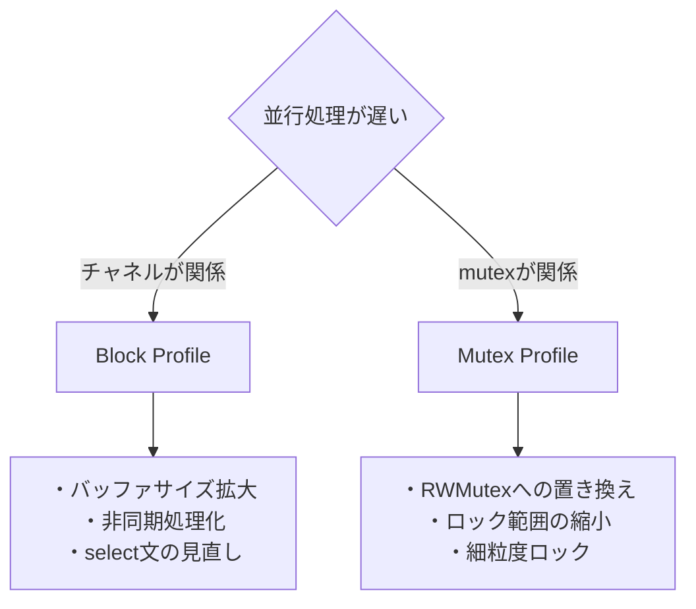

## Concurrency Profilingとは

並行処理におけるパフォーマンス問題を検出するための2つのプロファイル：

- **Block Profile**: goroutineがブロックされている時間を測定
- **Mutex Profile**: mutexのロック競合を測定

この2つを使い分けることで、並行処理のボトルネックを特定できます。

---

## Block Profile vs Mutex Profile

### 違いの理解

| 項目 | Block Profile | Mutex Profile |
|------|--------------|--------------|
| **測定対象** | チャネル操作、sync.Mutexなどでのブロック時間 | mutexのロック競合時間 |
| **有効化** | `runtime.SetBlockProfileRate(1)` | `runtime.SetMutexProfileFraction(1)` |
| **検出内容** | goroutineが待機している時間 | mutexで待たされている時間 |
| **ユースケース** | チャネルのバッファサイズ、select文の最適化 | ロック粒度の見直し、RWMutexへの置き換え |

### どちらを使うべきか



---

## 演習1: Block Profiling

### 演習の目的

プロデューサー・コンシューマーパターンを実装したプログラムを題材に、Block Profilingを使ってブロッキング問題を特定し、最適化します。

演習ディレクトリ: `exercises/profiling/04-block/`

### 問題の概要

このプログラムには以下のブロッキング問題が含まれています：

1. チャネルのバッファサイズが小さすぎる
2. 同期的な処理で不要なブロック
3. select文での非効率な待機

---

## Block Profiling 演習手順

### ステップ1: プロファイルの取得

```bash
cd exercises/profiling/04-block/

# Block プロファイルを取得
go run main.go -blockprofile=block.prof
```

**重要**: プログラム内で`runtime.SetBlockProfileRate(1)`が設定されている必要があります。

```go
import "runtime"

func init() {
    runtime.SetBlockProfileRate(1)  // 全てのブロックイベントを記録
}
```

### ステップ2: Webビューアで分析

```bash
go tool pprof -http=:8080 block.prof
```

#### Flame Graphでの確認

- 横幅が広い部分がブロック時間の長い箇所
- `chan send`や`chan receive`でのブロックが可視化される

#### Top ビュー

```
Showing nodes accounting for 5000ms, 95% of 5263ms total
      flat  flat%   sum%        cum   cum%
    3000ms 57.0% 57.0%     3000ms 57.0%  main.producer (chan send)
    2000ms 38.0% 95.0%     2000ms 38.0%  main.consumer (chan receive)
```

**各値の意味（Block Profileの場合）**:
- **flat**: その関数でブロックされた合計時間
- **flat%**: 全体のブロック時間に対する割合
- **関数名の後ろの情報**: ブロックの原因
  - `(chan send)`: チャネル送信でブロック
  - `(chan receive)`: チャネル受信でブロック
  - `(sync.Mutex.Lock)`: Mutexロック待ち
  - `(sync.Cond.Wait)`: Cond待ち

**値の判断基準**:
- **flat% 50%以上**: 重大なブロッキング問題
- **flat% 20-50%**: 中程度のブロッキング（改善の余地あり）
- **flat% 10%未満**: 軽微な影響

**この例の分析**:
- `main.producer`で57%の時間がブロック → チャネル送信が頻繁にブロック
- `main.consumer`で38%の時間がブロック → チャネル受信も頻繁にブロック
- **合わせて95%** → ほとんどの時間がブロックで消費されている（非効率）

**改善の方向性**:
- チャネルのバッファサイズを拡大
- consumer の数を増やす（並列処理）
- producer の送信頻度を調整

### ステップ3: CLIモードでの分析

```bash
go tool pprof block.prof
```

```
(pprof) top
(pprof) list producer
(pprof) list consumer
```

`list`コマンドで、どの行でブロックが発生しているかを確認します。

### ステップ4: 問題の特定

```go
// 問題のコード例
func producer(ch chan<- Data) {
    for i := 0; i < 10000; i++ {
        ch <- Data{ID: i}  // バッファが小さいとここでブロック
    }
}

func consumer(ch <-chan Data) {
    for data := range ch {
        time.Sleep(1 * time.Millisecond)  // 処理が遅い
        process(data)
    }
}

func main() {
    ch := make(chan Data)  // バッファなし！
    go producer(ch)
    consumer(ch)
}
```

**問題**:
1. チャネルのバッファが0（同期チャネル）
2. producerはconsumerが受信するまでブロック
3. consumerの処理が遅いため、producerが頻繁にブロック

---

## Block Profile 改善方法

### 改善1: バッファサイズの拡大

```go
// Before
ch := make(chan Data)  // バッファなし

// After
ch := make(chan Data, 100)  // バッファを追加
```

### 改善2: 非同期処理化

```go
// Before
func producer(ch chan<- Data) {
    for i := 0; i < 10000; i++ {
        ch <- Data{ID: i}  // ブロッキング
    }
}

// After
func producer(ctx context.Context, ch chan<- Data) {
    for i := 0; i < 10000; i++ {
        select {
        case ch <- Data{ID: i}:
            // 送信成功
        case <-ctx.Done():
            return  // キャンセル時は即座に終了
        }
    }
}
```

### 改善3: ワーカープールによる並列化

```go
// consumer を複数起動
func main() {
    ch := make(chan Data, 100)

    // 複数のconsumerで並列処理
    for i := 0; i < 4; i++ {
        go consumer(ch)
    }

    producer(ch)
}
```

---

## 演習2: Mutex Profiling

### 演習の目的

共有キャッシュを複数のgoroutineから読み書きするプログラムを題材に、Mutex Profilingを使ってロック競合を特定し、最適化します。

演習ディレクトリ: `exercises/profiling/05-mutex/`

### 問題の概要

このプログラムには以下のロック競合問題が含まれています：

1. 読み取りにもMutexを使用（RWMutexを使うべき）
2. ロックの範囲が広すぎる
3. 細粒度ロックを使用していない

---

## Mutex Profiling 演習手順

### ステップ1: プロファイルの取得

```bash
cd exercises/profiling/05-mutex/

# Mutex プロファイルを取得
go run main.go -mutexprofile=mutex.prof
```

**重要**: プログラム内で`runtime.SetMutexProfileFraction(1)`が設定されている必要があります。

```go
import "runtime"

func init() {
    runtime.SetMutexProfileFraction(1)  // 全ての競合を記録
}
```

### ステップ2: Webビューアで分析

```bash
go tool pprof -http=:8080 mutex.prof
```

#### Graphでの確認

- ノードのサイズが競合時間の長さを表す
- `sync.(*Mutex).Unlock`が競合発生箇所

#### Top ビュー

```
Showing nodes accounting for 8000ms, 92% of 8700ms total
      flat  flat%   sum%        cum   cum%
    5000ms 57.5% 57.5%     5000ms 57.5%  main.(*Cache).Get
    3000ms 34.5% 92.0%     3000ms 34.5%  main.(*Cache).Set
```

**各値の意味（Mutex Profileの場合）**:
- **flat**: その関数でmutex待ち（競合）に費やした合計時間
- **flat%**: 全体の競合時間に対する割合
- **contentions**: 実際の競合回数（デフォルトでは表示されないが、SAMPLEで切り替え可能）

**Mutex ProfileのSAMPLE切り替え**:
- `delay`: 競合で待たされた時間（デフォルト）
- `contentions`: 競合が発生した回数

**値の判断基準（delay基準）**:
- **flat% 30%以上**: 深刻なロック競合（早急な対応が必要）
- **flat% 10-30%**: 中程度のロック競合（改善推奨）
- **flat% 5-10%**: 軽度のロック競合（パフォーマンス要件次第）
- **flat% 5%未満**: 許容範囲

**この例の分析**:
- `main.(*Cache).Get`で57.5%の競合時間 → 読み取りで過度に待たされている
  - 原因: `sync.Mutex`を使用しているため、読み取りでも排他ロック
  - 対策: `sync.RWMutex`に変更すれば読み取りは並列化可能
- `main.(*Cache).Set`で34.5%の競合時間 → 書き込みでも競合
  - 原因: ロック範囲が広い、またはキーごとにロックを分けていない
  - 対策: ロック範囲の縮小、Sharding

**典型的なパターン**:
```
// パターン1: 読み取り競合が支配的
Get: 70%  → RWMutexへの変更が効果的
Set: 10%

// パターン2: 書き込み競合が支配的
Get: 10%
Set: 60%  → Sharding（細粒度ロック）が効果的

// パターン3: 両方とも高い
Get: 40%
Set: 40%  → RWMutex + Sharding の併用
```

**SAMPLEをcontentionsに変更した場合**:
```
      flat  flat%   sum%        cum   cum%
   100000 62.5% 62.5%    100000 62.5%  main.(*Cache).Get
    60000 37.5% 100%      60000 37.5%  main.(*Cache).Set
```
- 10万回のロック競合が発生（頻繁に競合している証拠）
- 1回あたりの平均待ち時間: 5000ms / 100000 = 0.05ms

### ステップ3: 問題の特定

```go
// 問題のコード例
type Cache struct {
    mu   sync.Mutex
    data map[string]string
}

func (c *Cache) Get(key string) (string, bool) {
    c.mu.Lock()
    defer c.mu.Unlock()
    val, ok := c.data[key]
    return val, ok  // 読み取りでもロック
}

func (c *Cache) Set(key, value string) {
    c.mu.Lock()
    defer c.mu.Unlock()

    // ロック範囲が広い
    time.Sleep(1 * time.Millisecond)  // 重い処理
    c.data[key] = value
}
```

**問題**:
1. 読み取り操作でも排他ロック（`sync.Mutex`）
2. ロック中に重い処理を実行
3. 読み取りと書き込みが同じロックで競合

---

## Mutex Profile 改善方法

### 改善1: RWMutexへの置き換え

```go
// Before
type Cache struct {
    mu   sync.Mutex
    data map[string]string
}

func (c *Cache) Get(key string) (string, bool) {
    c.mu.Lock()
    defer c.mu.Unlock()
    val, ok := c.data[key]
    return val, ok
}

// After
type Cache struct {
    mu   sync.RWMutex  // RWMutex に変更
    data map[string]string
}

func (c *Cache) Get(key string) (string, bool) {
    c.mu.RLock()  // 読み取りロック
    defer c.mu.RUnlock()
    val, ok := c.data[key]
    return val, ok
}
```

**効果**: 複数のgoroutineが同時に読み取り可能になり、競合が大幅に削減されます。

### 改善2: ロック範囲の縮小

```go
// Before
func (c *Cache) Set(key, value string) {
    c.mu.Lock()
    defer c.mu.Unlock()

    time.Sleep(1 * time.Millisecond)  // ロック中に重い処理
    c.data[key] = value
}

// After
func (c *Cache) Set(key, value string) {
    // 重い処理はロック外で実行
    time.Sleep(1 * time.Millisecond)

    c.mu.Lock()
    c.data[key] = value  // 最小限のロック
    c.mu.Unlock()
}
```

### 改善3: 細粒度ロック（Sharding）

```go
// Before
type Cache struct {
    mu   sync.RWMutex
    data map[string]string
}

// After
type Cache struct {
    shards []*CacheShard
}

type CacheShard struct {
    mu   sync.RWMutex
    data map[string]string
}

func (c *Cache) getShard(key string) *CacheShard {
    hash := fnv.New32()
    hash.Write([]byte(key))
    return c.shards[hash.Sum32()%uint32(len(c.shards))]
}

func (c *Cache) Get(key string) (string, bool) {
    shard := c.getShard(key)
    shard.mu.RLock()
    defer shard.mu.RUnlock()
    val, ok := shard.data[key]
    return val, ok
}
```

**効果**: 異なるキーへのアクセスが並列化され、競合がさらに削減されます。

---

## 改善版の検証

### Block Profile の検証

```bash
# 改善版のプロファイル取得
go run main_fixed.go -blockprofile=block_fixed.prof

# Before/After 比較
go tool pprof -http=:8080 -base=block.prof block_fixed.prof

# 実行時間の比較
time go run main.go
time go run main_fixed.go
```

期待される改善:
- ブロック時間: **約1/10に削減**
- 実行時間: **約2-3倍高速化**

### Mutex Profile の検証

```bash
# 改善版のプロファイル取得
go run main_fixed.go -mutexprofile=mutex_fixed.prof

# Before/After 比較
go tool pprof -http=:8080 -base=mutex.prof mutex_fixed.prof

# ベンチマーク比較
go test -bench=. -benchmem
```

期待される改善:
- ロック競合時間: **約1/20に削減**
- スループット: **約10倍向上**
- 読み取り操作: **ほぼ競合なし**

---

## ベストプラクティス

### 1. Block Profileの活用場面

- チャネルを多用するプログラム
- プロデューサー・コンシューマーパターン
- パイプラインパターン

### 2. Mutex Profileの活用場面

- 共有状態を持つプログラム
- キャッシュの実装
- カウンタや統計情報の集計

### 3. 最適化の優先順位

1. まずMutex Profileで大きな競合を特定
2. RWMutexへの置き換えを検討
3. ロック範囲の縮小
4. 必要に応じてShardingを導入

---

## まとめ

Concurrency Profilingを使うことで：

1. **Block Profile**: チャネル操作でのブロックを可視化し、バッファサイズや並列度を最適化
2. **Mutex Profile**: ロック競合を特定し、RWMutexや細粒度ロックで改善
3. **並行処理のボトルネック**: データドリブンな最適化が可能

これでProfilingの演習は完了です。次は[Trace]()で時系列での実行状態を可視化します。
