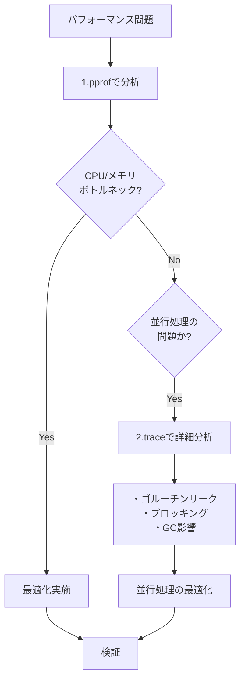

## runtime/traceとは

runtime/traceは、Goプログラムの実行イベントを**時系列で記録**し、並行処理の挙動を可視化するツールです。pprofが統計的なサンプリングであるのに対し、traceは全てのイベントを詳細に記録します。


### 概要

**全イベント記録**で実行状態を時系列で可視化します。

### 主なツール

- `runtime/trace` - トレース機能
- `go tool trace` - トレース分析
- Flight Recorder - 常時記録（**Go 1.25.0以降**）

### 収集できる情報

- Goroutineの生成・実行・ブロック・終了
- チャネル送受信
- Mutex lock/unlock
- GCイベント
- Processor（P）の状態
- User-defined Task/Region/Log

### 得意なこと

- ✓ 並行処理の可視化
- ✓ タイムラインでの状態確認
- ✓ Goroutineリークの詳細調査
- ✓ GCの影響分析

### 苦手なこと

- ✗ CPU使用率の詳細
- ✗ メモリ使用量の詳細
- ✗ 長時間の記録（ファイルサイズ大）

---

## pprofとtraceの違い

### 比較表

| 特徴 | pprof | trace |
|------|-------|-------|
| **データ形式** | サンプリング（統計） | 全イベント記録 |
| **表示形式** | 集計データ | タイムライン |
| **オーバーヘッド** | 低い（1-5%） | **低い（1-2%、Go 1.21+）** |
| **ファイルサイズ** | 小さい（数MB） | 大きい（数十～数百MB） |
| **用途** | ボトルネック特定 | 並行処理の可視化 |
| **CPU使用率** | ✓ | △ |
| **メモリ使用量** | ✓ | ✗ |
| **ゴルーチン挙動** | 部分的 | ✓ |
| **タイムライン** | ✗ | ✓ |

> [!NOTE]
> **Go 1.21以降でオーバーヘッドが劇的に改善**
> Go 1.21より前は10-20%のオーバーヘッドでしたが、フレームポインタアンワインディングの最適化により**1-2%に削減**されました。これにより、本番環境での継続的な使用が現実的になりました。
>
> 参考: [More powerful Go execution traces (2024)](https://go.dev/blog/execution-traces-2024)

### 使い分けの戦略



**推奨ワークフロー**:
1. **pprof**: CPU/メモリボトルネックを特定
2. **trace**: 並行処理の問題を詳しく調査
3. Task/Region/Logでカスタマイズ
4. 改善後に再度traceで確認

---

## traceで収集できる情報

### 記録されるイベント

runtime/traceは以下のイベントを全て記録します：

| イベント | 説明 |
|---------|------|
| **Goroutine** | 生成・実行・ブロック・終了 |
| **System call** | enter/exit/block |
| **Channel** | 送信・受信 |
| **Mutex** | ロック/アンロック |
| **GC** | GC開始・停止・フェーズ |
| **Processor (P)** | 開始・停止・アイドル |
| **Network I/O** | ネットワーク操作 |
| **User annotation** | Task/Region/Log |

### traceの強み

1. **完全な可視化**: すべてのイベントを時系列で記録
2. **タイムライン**: いつ何が起きたか一目で分かる
3. **goroutine追跡**: 各goroutineの状態遷移を詳細に分析
4. **アノテーション**: Task/Region/Logでカスタマイズ可能

### traceの弱み

1. **オーバーヘッド**: 実行速度が10-30%遅くなる
2. **ファイルサイズ**: 長時間のトレースは数百MBになる
3. **CPU/メモリプロファイル**: pprofの方が適している

---

## traceの取得方法

### 方法1: プログラムに組み込む

```go
import (
    "os"
    "runtime/trace"
)

func main() {
    f, err := os.Create("trace.out")
    if err != nil {
        panic(err)
    }
    defer f.Close()

    if err := trace.Start(f); err != nil {
        panic(err)
    }
    defer trace.Stop()

    // プログラムの処理
    doWork()
}
```

### 方法2: テストで取得

```bash
go test -trace=trace.out
```

ベンチマークと組み合わせて：

```bash
go test -bench=. -trace=trace.out
```

### 方法3: net/http/pprof経由

```go
import (
    _ "net/http/pprof"
    "net/http"
)

func main() {
    go func() {
        http.ListenAndServe("localhost:6060", nil)
    }()

    // アプリケーションコード
}
```

```bash
# 5秒間のトレースを取得
curl http://localhost:6060/debug/pprof/trace?seconds=5 > trace.out

# トレース分析
go tool trace trace.out
```

---

## go tool traceの使い方

### トレースビューアの起動

```bash
go tool trace trace.out
```

ブラウザが自動的に開き、以下のビューが利用できます。

### 主要ビュー

#### 1. View trace（最重要）

タイムラインビューで実行状態を可視化します。

**表示内容**:
- **横軸**: 時間
- **縦軸**:
  - **Goroutines**: goroutineの実行状態
  - **Heap**: ヒープサイズの推移
  - **Threads**: OSスレッド数
  - **GC**: GCイベント
  - **PROCS**: プロセッサ（P）の状態

**キーボード操作**:
- `W` / `S`: ズームイン/アウト
- `A` / `D`: 左右スクロール
- `1` / `2` / `3` / `4`: 異なる詳細レベル
- クリック: イベント詳細表示

**色の意味**:
- **緑**: 実行中（Running）
- **グレー**: ブロック中（Blocked）
- **黄色**: 待機中（Runnable - スケジュール待ち）

#### 2. Goroutine analysis

各goroutineが何に時間を使っているかを集計します。

| 項目 | 説明 |
|------|------|
| **Execution** | CPU実行時間 |
| **Network wait** | ネットワーク待ち |
| **Sync block** | 同期プリミティブでのブロック（mutex、チャネル等） |
| **Blocking syscall** | システムコール待ち |
| **Scheduler wait** | スケジューラ待ち |
| **GC sweeping** | GCスイープ処理 |
| **GC pause** | GC停止時間 |

**使い方**:
- Sync blockが多い → チャネルやmutexの問題
- Scheduler waitが多い → goroutineが多すぎる
- GC pauseが多い → GCの影響が大きい

#### 3. Network / Synchronization / Syscall blocking profile

pprof形式のブロッキングプロファイルです。

- **Network blocking**: ネットワークI/O
- **Synchronization blocking**: mutex、チャネル
- **Syscall blocking**: システムコール

#### 4. Scheduler latency profile

goroutineがスケジュール待ちで費やした時間を表示します。

#### 5. User-defined tasks

Task アノテーション（`trace.NewTask()`）を使用している場合のみ表示されます。

- タスクタイプごとの一覧
- 各タスクの実行回数と時間
- レイテンシ分布

---

## User-defined Annotation

traceには、プログラムに意味のあるラベルを付けるためのアノテーションAPIがあります。

### Task: 複数goroutineにまたがる処理

```go
ctx, task := trace.NewTask(ctx, "processOrder")
defer task.End()

trace.Log(ctx, "order", "OrderID: 123")

// 別のgoroutineにctxを渡すと、同じTaskに紐付く
go worker(ctx)
```

**用途**:
- Webリクエスト処理
- ワーカージョブ
- バッチ処理

**表示**: User-defined tasksビュー

### Region: goroutine内の時間区間

```go
// 方法1: WithRegion
trace.WithRegion(ctx, "parseJSON", func() {
    json.Unmarshal(data, &result)
})

// 方法2: StartRegion / End
defer trace.StartRegion(ctx, "saveDB").End()
doSave()
```

**用途**:
- パイプラインの各ステージ
- HTTPハンドラの各フェーズ
- 処理の各ステップ

**表示**: View traceのタイムライン上に色付きブロック

### Log: イベント記録

```go
trace.Log(ctx, "category", "message")
trace.Logf(ctx, "database", "Query took %dms", duration)
```

**用途**:
- 重要なマイルストーン
- エラーイベント
- メトリクス記録

**表示**: View traceでイベントとして表示

---

## 演習の構成

このワークショップでは、以下の演習を通じてtraceを学習します。

### Trace基本操作
- 演習ディレクトリ: `exercises/trace/01-basics/`
- 詳細: [Part 2-1: Trace Basics]()

### Task & Region アノテーション
- 演習ディレクトリ: `exercises/trace/02-task/`, `exercises/trace/03-region/`
- 詳細: [Part 2-2: Trace Annotation]()

### Flight Recorder
- 演習ディレクトリ: `exercises/trace/flightrecorder/`
- 詳細: [Part 2-3: Flight Recorder]()

---

## ベストプラクティス

### 1. トレース期間（Go 1.21+ではより柔軟に）

**Go 1.20以前**:
```go
// オーバーヘッドが高いため短時間のみ
time.Sleep(5 * time.Second)
```

**Go 1.21以降**:
```go
// オーバーヘッドが1-2%のため、より長時間のトレースが可能
time.Sleep(5 * time.Minute)  // 長時間でも問題なし
```

**Go 1.25.0以降（Flight Recorder使用時）**:
```go
// Flight Recorderを使えば継続的なトレースが可能
// 移動ウィンドウで最新データのみを保持
```

> [!NOTE]
> - **Go 1.21以降**: オーバーヘッドが1-2%に削減され、長時間のトレースが可能
> - **Go 1.25.0以降**: Flight Recorderにより、本番環境での継続的なトレースが現実的に

### 2. アノテーションの粒度

**良い例**:
```go
// 意味のある処理単位
trace.WithRegion(ctx, "databaseQuery", queryDB)
```

**悪い例**:
```go
// 細かすぎる（オーバーヘッドが大きい）
trace.WithRegion(ctx, "x++", func() { x++ })
```

### 3. Contextの伝播

```go
// 正しい: ctxを伝播
ctx, task := trace.NewTask(ctx, "main")
go worker(ctx)

// 間違い: ctxを渡さない
ctx, task := trace.NewTask(ctx, "main")
go worker()  // Taskに紐付かない
```

### 4. TaskとRegionの組み合わせ

```go
// Taskで全体を追跡
ctx, task := trace.NewTask(ctx, "handleRequest")
defer task.End()

// Regionで各ステップを測定
trace.WithRegion(ctx, "authentication", auth)
trace.WithRegion(ctx, "businessLogic", logic)
trace.WithRegion(ctx, "responseRender", render)
```

---

## 次のステップ

まずは[Trace Basics]()で基本的な使い方を学びましょう。
