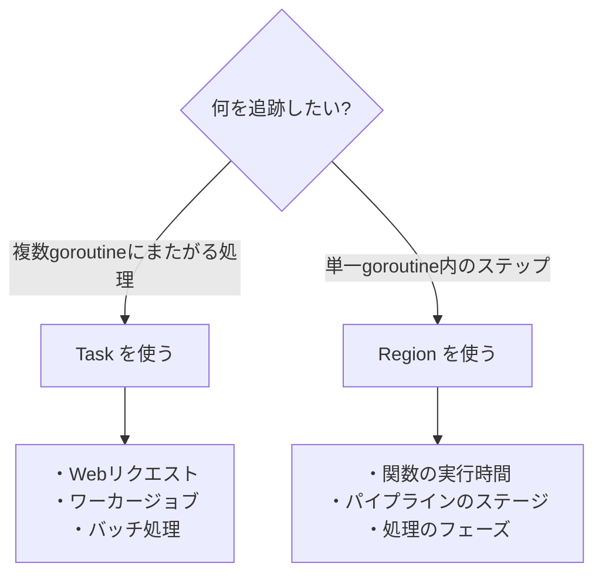

## Trace Annotationとは

runtime/traceには、プログラムに意味のあるラベルを付けるための**アノテーションAPI**があります。これにより、単なる「goroutineが実行された」という情報だけでなく、「どの注文を処理しているか」「どのステップを実行しているか」といった**業務ロジックの文脈**をトレースに埋め込めます。

---

## Task vs Region の違い

| 特徴 | Task | Region |
|------|------|--------|
| **スコープ** | 複数goroutineにまたがる | 単一goroutine内 |
| **用途** | 論理的な操作の追跡 | 時間区間の測定 |
| **表示場所** | User-defined tasksビュー | View traceのタイムライン |
| **ネスト** | 可能（親子関係） | 可能（階層構造） |
| **代表例** | Webリクエスト、ジョブ、バッチ | 関数、ステップ、フェーズ |

### 使い分けの指針



---

## 演習1: Task Annotation

### 演習の目的

複数のgoroutineにまたがる処理（注文処理）を題材に、Taskアノテーションで処理を追跡します。

演習ディレクトリ: `exercises/trace/02-task/`

### 問題の概要

注文処理システムで、各注文は以下の3つのフェーズを持ちます：
1. 在庫確認
2. 決済処理
3. 配送手配

各フェーズは異なるgoroutineで実行され、**どの注文がどのgoroutineで処理されているか追跡できない**のが問題です。

---

## Task 演習手順

### ステップ1: 問題版のトレース取得

```bash
cd exercises/trace/02-task/

go run main.go -trace=trace.out
go tool trace trace.out
```

#### 問題点の確認

**View trace**で：
- 複数のgoroutineが動いているが、どれがどの注文か不明
- goroutine間の関係がわからない

### ステップ2: 改善版のトレース取得

```bash
go run main_fixed.go -trace=trace_fixed.out
go tool trace trace_fixed.out
```

#### User-defined tasks ビュー

**新しいビューが出現！**

トレースビューアのメニューに**User-defined tasks**が追加されます。

- 各Task（注文）がリストされる
- Taskごとの処理時間（レイテンシ）が表示される

**確認ポイント**:
- `processOrder` Taskが5回実行されている
- 各Taskの開始時刻と終了時刻
- Taskごとのレイテンシ分布

#### View traceでの可視化

Taskを選択すると：
- そのTaskに関連するgoroutineがハイライトされる
- Taskのログイベントが表示される

---

## Task APIの使い方

### 基本パターン

```go
import (
    "context"
    "runtime/trace"
)

func processOrder(ctx context.Context, orderID int) {
    // Taskを作成
    ctx, task := trace.NewTask(ctx, "processOrder")
    defer task.End()

    // ログを記録
    trace.Logf(ctx, "order", "Processing order %d", orderID)

    // 処理を実行
    checkStock(ctx, orderID)
    processPayment(ctx, orderID)
    arrangeShipping(ctx, orderID)
}
```

### 複数goroutineにまたがる処理

```go
func processOrder(ctx context.Context, orderID int) {
    ctx, task := trace.NewTask(ctx, "processOrder")
    defer task.End()

    // 在庫確認（メインgoroutine）
    checkStock(ctx, orderID)

    // 決済と配送を並列実行
    var wg sync.WaitGroup

    wg.Add(1)
    go func() {
        defer wg.Done()
        processPayment(ctx, orderID)  // ctxを渡すことでTaskに紐付く
    }()

    wg.Add(1)
    go func() {
        defer wg.Done()
        arrangeShipping(ctx, orderID)  // 同じTaskに紐付く
    }()

    wg.Wait()
}
```

**重要**: `ctx`を各goroutineに渡すことで、全てのgoroutineが同じTaskに紐付きます。

### ログの記録

```go
trace.Log(ctx, "category", "message")
trace.Logf(ctx, "category", "OrderID: %d, Total: %d", orderID, total)
```

**ログのカテゴリ例**:
- `"order"`: 注文関連
- `"stock"`: 在庫関連
- `"payment"`: 決済関連
- `"delivery"`: 配送関連

---

## 演習2: Region Annotation

### 演習の目的

画像処理パイプライン（読み込み → リサイズ → フィルタ → 保存）を題材に、Regionアノテーションで各ステップの時間を可視化します。

演習ディレクトリ: `exercises/trace/03-region/`

### 問題の概要

画像処理は以下のステップで構成されますが、**各ステップにどれだけ時間がかかっているか不明**なのが問題です：

1. 画像の読み込み
2. リサイズ処理
3. フィルタ適用（blur, sharpen, colorAdjust）
4. 画像の保存

---

## Region 演習手順

### ステップ1: 問題版のトレース取得

```bash
cd exercises/trace/03-region/

go run main.go -trace=trace.out
go tool trace trace.out
```

#### 問題点の確認

**View trace**で：
- goroutineが実行されているのは見えるが、何をしているか不明
- 処理の区切りがわからない

### ステップ2: 改善版のトレース取得

```bash
go run main_fixed.go -trace=trace_fixed.out
go tool trace trace_fixed.out
```

#### View traceでの可視化

**Regionが色分けされて表示！**

goroutineの実行区間に色付きブロックが表示されます：
- `loadImage`: 緑色（短い）
- `resizeImage`: 青色（中程度）
- `applyFilter`: 赤色（長い）
  - サブRegion: `filter:blur`, `filter:sharpen`, `filter:colorAdjust`
- `saveImage`: 黄色（短い）

**クリック時の詳細**:
- Region名
- 実行時間（Duration）
- 開始時刻（Start time）

---

## Region APIの使い方

### 方法1: WithRegion（推奨）

```go
trace.WithRegion(ctx, "regionName", func() {
    // この中の処理がRegionとして記録される
    doWork()
})
```

**利点**:
- 自動的にRegionが終了する
- スコープが明確

### 方法2: StartRegion / End

```go
region := trace.StartRegion(ctx, "regionName")
doWork()
region.End()

// deferパターン
defer trace.StartRegion(ctx, "regionName").End()
doWork()
```

**利点**:
- 柔軟性が高い
- 複数のreturnパスがある場合に便利

### ネストしたRegion

```go
trace.WithRegion(ctx, "applyFilter", func() {
    // 外側のRegion

    trace.WithRegion(ctx, "filter:blur", func() {
        // 内側のRegion（ネスト）
        applyBlur()
    })

    trace.WithRegion(ctx, "filter:sharpen", func() {
        applySharpen()
    })
})
```

トレースでは、内側のRegionが外側のRegionの中に表示されます。

---

## 実践例

### 例1: Webリクエスト処理

```go
func handleRequest(w http.ResponseWriter, r *http.Request) {
    ctx := r.Context()

    // Taskで全体を追跡
    ctx, task := trace.NewTask(ctx, "handleRequest")
    defer task.End()

    // 各フェーズをRegionで測定
    trace.WithRegion(ctx, "authentication", func() {
        authenticate(r)
    })

    trace.WithRegion(ctx, "parseRequest", func() {
        parseRequest(r)
    })

    trace.WithRegion(ctx, "queryDatabase", func() {
        queryDB(ctx)
    })

    trace.WithRegion(ctx, "renderTemplate", func() {
        renderHTML(w)
    })
}
```

### 例2: データ処理パイプライン

```go
func processBatch(ctx context.Context, items []Item) {
    ctx, task := trace.NewTask(ctx, "processBatch")
    defer task.End()

    trace.WithRegion(ctx, "validation", func() {
        for _, item := range items {
            validate(item)
        }
    })

    trace.WithRegion(ctx, "transformation", func() {
        for _, item := range items {
            // サブRegion
            trace.WithRegion(ctx, "transformItem", func() {
                transform(item)
            })
        }
    })

    trace.WithRegion(ctx, "persistence", func() {
        saveItems(items)
    })
}
```

### 例3: 複雑な計算

```go
func complexCalculation(ctx context.Context, data []float64) {
    defer trace.StartRegion(ctx, "complexCalculation").End()

    trace.WithRegion(ctx, "preprocessing", func() {
        normalize(data)
    })

    trace.WithRegion(ctx, "fft", func() {
        fft(data)
    })

    trace.WithRegion(ctx, "analysis", func() {
        analyze(data)
    })
}
```

---

## ベストプラクティス

### 1. Taskの粒度

**良い例**:
```go
// リクエスト単位でTask
ctx, task := trace.NewTask(ctx, "handleRequest")
```

**悪い例**:
```go
// 細かすぎる（オーバーヘッド大）
ctx, task := trace.NewTask(ctx, "addTwoNumbers")
```

### 2. Regionの粒度

**良い例**:
```go
// 意味のある処理単位
trace.WithRegion(ctx, "parseJSON", func() {
    json.Unmarshal(data, &result)
})
```

**悪い例**:
```go
// 細かすぎる
trace.WithRegion(ctx, "i++", func() { i++ })
```

### 3. 命名規則

**良い例**:
```go
trace.WithRegion(ctx, "database:query", func() {...})
trace.WithRegion(ctx, "cache:get", func() {...})
trace.Logf(ctx, "payment", "Amount: %d", amount)
```

**推奨**:
- カテゴリを含める（`category:action`）
- 説明的な名前
- 一貫した命名規則

### 4. Contextの伝播

**良い例**:
```go
ctx, task := trace.NewTask(ctx, "main")
go worker(ctx)  // ctxを渡す
```

**悪い例**:
```go
ctx, task := trace.NewTask(ctx, "main")
go worker()  // ctxを渡さない → 別のTaskとして扱われる
```

### 5. TaskとRegionの組み合わせ

```go
// Taskで全体を追跡
ctx, task := trace.NewTask(ctx, "processOrder")
defer task.End()

// Regionで各ステップを測定
trace.WithRegion(ctx, "validation", validate)
trace.WithRegion(ctx, "processing", process)
trace.WithRegion(ctx, "notification", notify)
```

---

## トラブルシューティング

### User-defined tasksが表示されない

**原因**: Taskアノテーションがない

**解決**: `trace.NewTask()`を追加

### Taskがグループ化されない

**原因**: ctxが伝播していない

**解決**: goroutineにctxを渡す

### Regionが表示されない

**原因**: RegionのEnd()が呼ばれていない

**解決**: `WithRegion`を使うか、`defer region.End()`

---

## まとめ

Trace Annotationを使うことで：

1. **Task**: 複数goroutineにまたがる処理を追跡
   - Webリクエスト、ジョブ、バッチ処理

2. **Region**: goroutine内のステップを可視化
   - 各フェーズの処理時間を測定
   - ボトルネック特定

3. **Log**: 重要なイベントを記録
   - マイルストーン、エラー、メトリクス

次は[Flight Recorder]()で本番環境でのトレース取得戦略を学びます。
