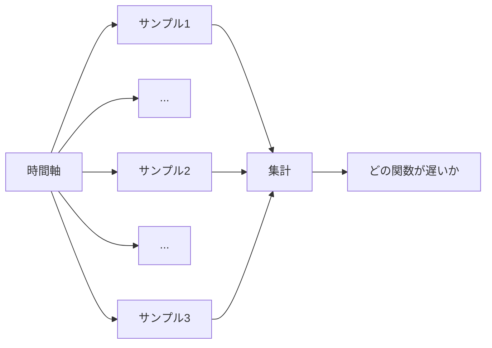
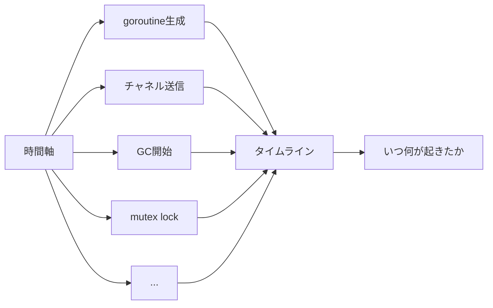
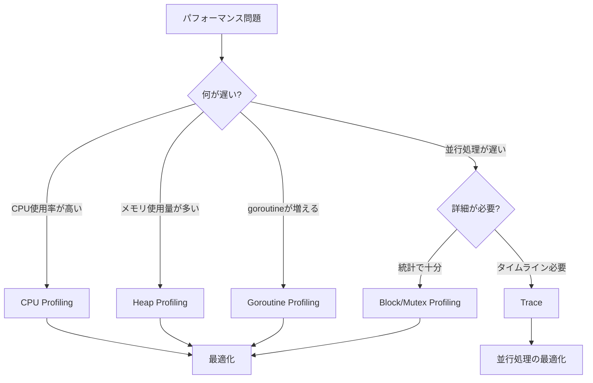
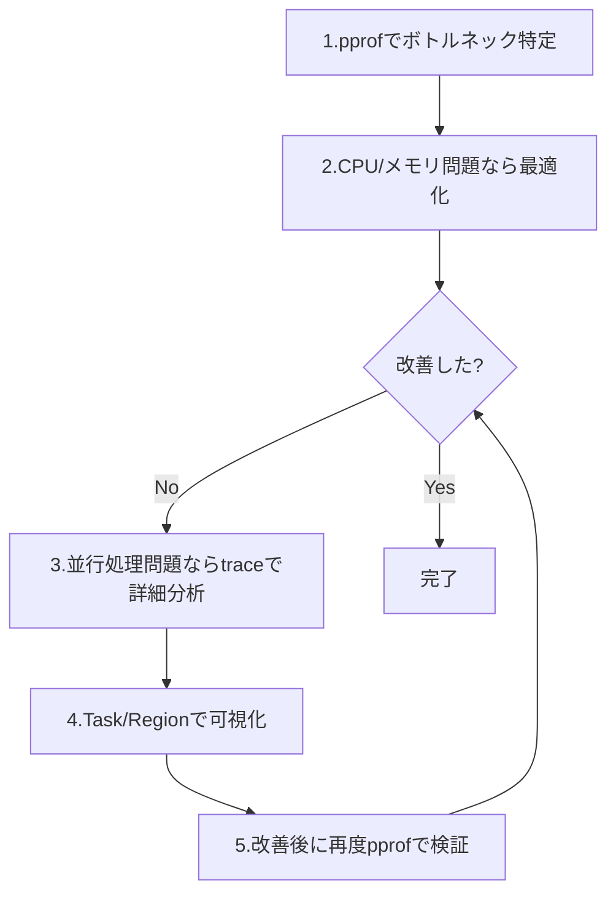

## 概要

ProfilingとTraceは、どちらもGoプログラムのパフォーマンス分析に使用されますが、**異なる目的と仕組み**を持っています。このページでは、それぞれの特徴と使い分けを整理します。

---

## データ収集方式の違い

### Profiling: サンプリングベース



- **方式**: 一定間隔（例: 10ms）でサンプル取得
- **データ**: 統計情報（累積値）
- **オーバーヘッド**: 低い（1-5%）

### Trace: 全イベント記録



- **方式**: 全てのイベントを記録
- **データ**: 時系列情報（タイムライン）
- **オーバーヘッド**: 高い（10-30%）

---

## 比較表

### 機能面の比較

| 項目 | Profiling (pprof) | Trace (runtime/trace) |
|------|-------------------|----------------------|
| **CPU使用率** | ✓ 詳細に測定可能 | △ 概要のみ |
| **メモリ使用量** | ✓ 詳細に測定可能 | ✗ 測定不可 |
| **Goroutine挙動** | △ 部分的 | ✓ 完全に可視化 |
| **タイムライン** | ✗ なし | ✓ あり |
| **ブロッキング** | ✓ 集計データ | ✓ 時系列データ |
| **GC影響** | △ 間接的 | ✓ 直接可視化 |
| **並行処理** | △ 統計のみ | ✓ 詳細に追跡 |

### 運用面の比較

| 項目 | Profiling | Trace (Go 1.21+) |
|------|-----------|------------------|
| **オーバーヘッド** | 低い（1-5%） | **低い（1-2%）** |
| **ファイルサイズ** | 小さい（数MB） | 大きい（数十～数百MB） |
| **記録時間** | 長時間可能（分～時間） | **長時間可能（Go 1.21+）** |
| **本番環境** | 常時有効化可能 | **常時有効化可能（Go 1.21+）** |
| **学習コスト** | 低い | 中～高 |

> [!IMPORTANT]
> **Go 1.21以降でtraceの運用面が大幅に改善**
>
> - **オーバーヘッド**: 10-20% → **1-2%** に削減（Go 1.21+）
> - **本番環境での利用**: 問題発生時のみ → **常時有効化が可能**（Go 1.21+）
> - **Flight Recorder**: 継続的にトレースを実行し、問題発生時にスナップショット取得（**Go 1.25.0以降**）
> - **スケーラビリティ**: 定期的な分割により、大規模トレースでもメモリ効率が向上（Go 1.22+）
>
> 参考: [More powerful Go execution traces (2024)](https://go.dev/blog/execution-traces-2024)

---

## それぞれで得られる情報

### Profilingで得られる情報

#### CPU Profile

```
✓ どの関数がCPU時間を消費しているか
✓ 関数ごとのCPU使用率
✓ ホットパス（よく実行されるパス）
✗ いつ実行されたか（時系列）
✗ goroutine間の関係
```

**ユースケース**:
- 重い計算処理の特定
- ループの最適化
- アルゴリズムの改善

#### Heap Profile

```
✓ どこでメモリを割り当てているか
✓ メモリリークの検出
✓ 割り当て回数と総量
✗ いつ割り当てられたか
✗ GCの影響
```

**ユースケース**:
- メモリリークの調査
- アロケーション削減
- GC負荷の軽減

#### Goroutine Profile

```
✓ 現在のgoroutine数
✓ goroutineのスタックトレース
✗ goroutineの状態遷移
✗ いつ生成/終了したか
```

**ユースケース**:
- goroutineリークの検出
- デッドロックの調査

#### Block & Mutex Profile

```
✓ どこでブロッキングが発生しているか
✓ ブロッキングの累積時間
✗ ブロッキングのタイミング
✗ 同時に何が起きていたか
```

**ユースケース**:
- チャネルのバッファサイズ調整
- mutex競合の特定

### Traceで得られる情報

#### View trace

```
✓ goroutineの生成・実行・終了のタイムライン
✓ いつブロックされたか
✓ GCの発生タイミングと影響
✓ プロセッサ（P）の利用状況
✗ 関数ごとのCPU使用率
✗ メモリ割り当て量
```

**ユースケース**:
- goroutineの状態遷移の可視化
- GCのSTW（Stop-The-World）の影響確認
- スケジューラの挙動確認

#### Task & Region

```
✓ 複数goroutineにまたがる処理の追跡
✓ 各ステップの処理時間
✓ レイテンシ分布
✗ CPU/メモリ使用量
```

**ユースケース**:
- リクエスト処理の可視化
- パイプラインのボトルネック特定

---

## 使い分けの戦略

### ステップ1: 問題の種類を特定



### ステップ2: 推奨ワークフロー



---

## 実践的な使い分け例

### 例1: CPU使用率が高い

**症状**: サーバーのCPU使用率が90%

**アプローチ**:
1. **CPU Profiling**で重い関数を特定
2. 関数を最適化（アルゴリズム改善、キャッシュ活用）
3. 再度CPU Profilingで効果を検証

**Traceは不要**: CPUボトルネックなので、pprofで十分

### 例2: メモリ使用量が増加し続ける

**症状**: メモリ使用量が時間とともに増加

**アプローチ**:
1. **Heap Profiling（inuse_space）** でメモリリークを検出
2. **Goroutine Profiling**でgoroutineリークを確認
3. リークしているgoroutineやオブジェクトを修正
4. 再度プロファイリングで検証

**Traceは不要**: メモリ問題なので、pprofで十分

### 例3: リクエスト処理が遅い（並行処理あり）

**症状**: 一部のリクエストが異常に遅い

**アプローチ**:
1. **CPU/Heap Profiling**で明らかなボトルネックがないか確認
2. **Trace + Task**でリクエスト処理を可視化
3. View traceでgoroutineのブロッキングを確認
4. チャネルバッファ拡大、ワーカー数調整
5. **Block/Mutex Profiling**で改善効果を検証

**TraceとProfilingの両方を使用**: 並行処理の問題なので、詳細な可視化が必要

### 例4: GCの影響を確認したい

**症状**: レイテンシにスパイクが発生

**アプローチ**:
1. **Trace**でGCのSTW（Stop-The-World）を可視化
2. **Heap Profiling（alloc_space）** でアロケーションを削減
3. sync.Pool、事前確保などで最適化
4. 再度Traceでgc頻度を確認

**Traceが重要**: GCのタイミングと影響はtraceで直接確認

---

## それぞれを使うべき場面

### Profilingを使うべき場面

✓ CPUボトルネックの特定
✓ メモリリークの検出
✓ 関数レベルの最適化
✓ 本番環境での継続的監視
✓ 長時間の分析（数分～数時間）

### Traceを使うべき場面

✓ goroutineリークの詳細調査
✓ ブロッキング原因の時系列分析
✓ GCの影響確認
✓ 並行処理の挙動確認
✓ レイテンシのばらつき分析
✓ 複数goroutineにまたがる処理の追跡

### 両方を使うべき場面

✓ 並行処理の最適化（pprofで統計、traceで詳細）
✓ パフォーマンス問題の根本原因調査
✓ 改善前後の効果測定

---

## まとめ

### それぞれの得意分野

| ツール | 得意なこと | 苦手なこと |
|--------|-----------|-----------|
| **Profiling** | CPU/メモリのボトルネック特定 | 時系列情報、goroutine挙動 |
| **Trace** | 並行処理の可視化、タイムライン | CPU/メモリ使用量の詳細 |

### 推奨アプローチ

1. まず**pprof**でボトルネックを特定
2. CPU/メモリ問題なら**pprof**で最適化
3. 並行処理問題なら**trace**で詳細分析
4. Task/Regionで**trace**をカスタマイズ
5. 改善後に再度**pprof**で検証

次は[本番運用のTips]()で本番環境での運用を学びます。
