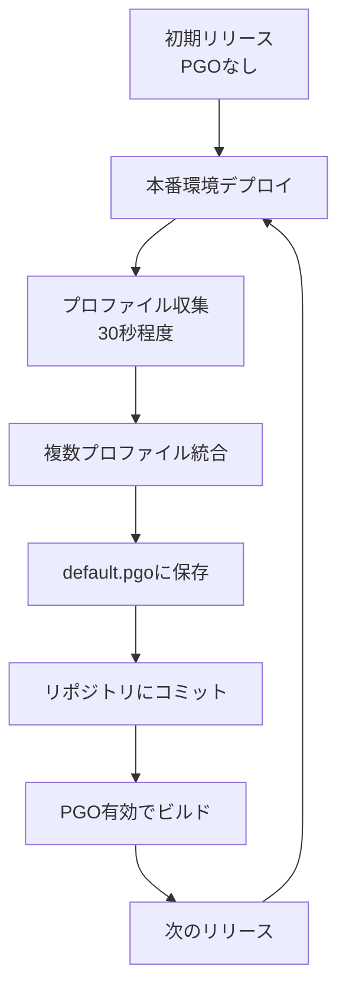

## 本番環境での計装

### net/http/pprofのセキュリティ考慮事項

#### 問題: 公開エンドポイントでの情報漏洩

```go
// 危険: 誰でもアクセス可能
import _ "net/http/pprof"

func main() {
    http.ListenAndServe(":8080", nil)  // 全てのエンドポイントが公開
}
```

**リスク**:
- `/debug/pprof/`が公開される
- メモリダンプ、goroutineスタックが露出
- システム内部情報の漏洩

#### 解決策1: 別ポートで提供

```go
import (
    "net/http"
    _ "net/http/pprof"
)

func main() {
    // デバッグ用エンドポイント（内部ネットワークのみ）
    go func() {
        http.ListenAndServe("localhost:6060", nil)
    }()

    // 公開用エンドポイント
    http.ListenAndServe(":8080", appHandler())
}
```

#### 解決策2: 認証付きエンドポイント

```go
func pprofAuthMiddleware(next http.Handler) http.Handler {
    return http.HandlerFunc(func(w http.ResponseWriter, r *http.Request) {
        username, password, ok := r.BasicAuth()
        if !ok || username != "admin" || password != os.Getenv("PPROF_PASSWORD") {
            w.Header().Set("WWW-Authenticate", `Basic realm="pprof"`)
            http.Error(w, "Unauthorized", http.StatusUnauthorized)
            return
        }
        next.ServeHTTP(w, r)
    })
}

func main() {
    mux := http.NewServeMux()

    // pprofエンドポイントに認証を追加
    mux.Handle("/debug/pprof/", pprofAuthMiddleware(http.DefaultServeMux))

    http.ListenAndServe(":6060", mux)
}
```

#### 解決策3: 環境変数での制御

```go
func main() {
    if os.Getenv("ENABLE_PPROF") == "true" {
        go func() {
            log.Println("pprof enabled on :6060")
            http.ListenAndServe("localhost:6060", nil)
        }()
    }

    // アプリケーション起動
    runApp()
}
```

---

## 本番環境でのプロファイリング戦略

### CPU Profiling

#### 常時有効化（推奨）

```go
import _ "net/http/pprof"

func main() {
    go func() {
        http.ListenAndServe("localhost:6060", nil)
    }()

    runApp()
}
```

**オーバーヘッド**: 1-5%（許容範囲）

#### 使用方法

```bash
# 30秒間のCPUプロファイル取得
curl http://localhost:6060/debug/pprof/profile?seconds=30 > cpu.prof

# 分析
go tool pprof cpu.prof
```

### Heap Profiling

#### 定期的なスナップショット取得

```go
func setupHeapProfiler() {
    go func() {
        ticker := time.NewTicker(10 * time.Minute)
        for range ticker.C {
            f, err := os.Create(fmt.Sprintf("heap_%d.prof", time.Now().Unix()))
            if err != nil {
                continue
            }
            pprof.WriteHeapProfile(f)
            f.Close()
        }
    }()
}
```

#### 使用方法

```bash
# ヒープスナップショット取得
curl http://localhost:6060/debug/pprof/heap > heap.prof

# 分析（inuse_space）
go tool pprof -sample_index=inuse_space heap.prof

# 分析（alloc_space - GC負荷確認）
go tool pprof -sample_index=alloc_space heap.prof
```

### Block & Mutex Profiling

#### 有効化の判断

**注意**: オーバーヘッドが大きいため、常時有効化は推奨しません。

```go
import "runtime"

func main() {
    // 問題調査時のみ有効化
    if os.Getenv("ENABLE_BLOCK_PROFILE") == "true" {
        runtime.SetBlockProfileRate(1)
    }

    if os.Getenv("ENABLE_MUTEX_PROFILE") == "true" {
        runtime.SetMutexProfileFraction(1)
    }

    runApp()
}
```

### Trace

#### Flight Recorderの活用（Go 1.25.0以降）

```go
import "runtime/trace"

var flightRecorder *trace.FlightRecorder

func main() {
    // Flight Recorder常時有効化（Go 1.25.0以降）
    flightRecorder = trace.NewFlightRecorder()
    flightRecorder.Start()
    defer flightRecorder.Stop()

    // スナップショット取得エンドポイント
    http.HandleFunc("/debug/trace/snapshot", snapshotHandler)

    runApp()
}

func snapshotHandler(w http.ResponseWriter, r *http.Request) {
    w.Header().Set("Content-Type", "application/octet-stream")
    w.Header().Set("Content-Disposition", "attachment; filename=trace.out")
    flightRecorder.WriteTo(w)
}
```

> [!NOTE]
> Flight Recorderは**Go 1.25.0以降**で利用可能です。それ以前のバージョンを使用している場合は、通常の`trace.Start()`を使用してください。

**使用方法**:
```bash
# トレーススナップショット取得
curl http://localhost:6060/debug/trace/snapshot > trace.out

# 分析
go tool trace trace.out
```

---

## 継続的なパフォーマンス監視

### メトリクスの収集

#### Prometheusとの統合

```go
import (
    "github.com/prometheus/client_golang/prometheus"
    "github.com/prometheus/client_golang/prometheus/promhttp"
)

var (
    goroutineCount = prometheus.NewGauge(prometheus.GaugeOpts{
        Name: "go_goroutines",
        Help: "Number of goroutines",
    })

    heapInuse = prometheus.NewGauge(prometheus.GaugeOpts{
        Name: "go_memstats_heap_inuse_bytes",
        Help: "Heap memory in use",
    })
)

func init() {
    prometheus.MustRegister(goroutineCount)
    prometheus.MustRegister(heapInuse)
}

func updateMetrics() {
    go func() {
        ticker := time.NewTicker(10 * time.Second)
        for range ticker.C {
            goroutineCount.Set(float64(runtime.NumGoroutine()))

            var m runtime.MemStats
            runtime.ReadMemStats(&m)
            heapInuse.Set(float64(m.HeapInuse))
        }
    }()
}

func main() {
    updateMetrics()

    http.Handle("/metrics", promhttp.Handler())
    http.ListenAndServe(":2112", nil)
}
```

### アラートの設定

#### Prometheusアラートルール

```yaml
groups:
  - name: go_performance
    rules:
      - alert: HighGoroutineCount
        expr: go_goroutines > 10000
        for: 5m
        annotations:
          summary: "High goroutine count"

      - alert: MemoryLeak
        expr: rate(go_memstats_heap_inuse_bytes[5m]) > 0
        for: 30m
        annotations:
          summary: "Possible memory leak"

      - alert: HighGCPressure
        expr: rate(go_gc_duration_seconds_sum[5m]) > 0.1
        for: 5m
        annotations:
          summary: "High GC pressure"
```

---

## パフォーマンス最適化のワークフロー

### ステップ1: ベースライン測定

```bash
# ベンチマーク実行
go test -bench=. -benchmem -cpuprofile=cpu_before.prof -memprofile=mem_before.prof

# 結果を保存
Benchmark-8    1000    1000000 ns/op    500000 B/op    1000 allocs/op
```

### ステップ2: ボトルネック特定

```bash
# CPU プロファイル分析
go tool pprof -http=:8080 cpu_before.prof

# メモリプロファイル分析
go tool pprof -http=:8080 -sample_index=alloc_space mem_before.prof
```

### ステップ3: 最適化実施

- アルゴリズム改善
- データ構造の見直し
- アロケーション削減
- 並行処理の調整

### ステップ4: 効果測定

```bash
# 改善後のベンチマーク
go test -bench=. -benchmem -cpuprofile=cpu_after.prof -memprofile=mem_after.prof

# Before/After 比較
go tool pprof -http=:8080 -base=cpu_before.prof cpu_after.prof
```

### ステップ5: 本番環境での検証

```bash
# 本番環境でプロファイル取得
curl http://prod-server:6060/debug/pprof/profile?seconds=30 > cpu_prod.prof

# 分析
go tool pprof cpu_prod.prof
```

---

## よくある落とし穴

### 1. 過度な最適化

**問題**: 可読性を犠牲にした最適化

**解決**: プロファイリング結果に基づいて、本当に必要な箇所だけ最適化

### 2. 本番環境でのトレース取得（Go 1.20以前）

**問題（Go 1.20以前）**: 長時間のトレース取得でパフォーマンス低下（10-20%のオーバーヘッド）

**解決（Go 1.21+）**:
- オーバーヘッドが**1-2%に削減**され、常時有効化が可能に
- Flight Recorderを使用し、問題発生時のみスナップショット取得
- 本番環境での継続的なトレースが現実的に

### 3. プロファイリングの解釈ミス

**問題**: サンプリングノイズを本当の問題と誤認

**解決**: 複数回測定し、一貫した結果を確認

### 4. 本番環境と開発環境の差異

**問題**: 開発環境では再現しない問題

**解決**: 本番環境でプロファイリングを実施

---

## まとめ

### ProfilingのTips

1. **CPU Profiling**: 本番環境で常時有効化（オーバーヘッド低い）
2. **Heap Profiling**: 定期的にスナップショット取得
3. **Goroutine Profiling**: メトリクスで監視、異常時にプロファイル取得
4. **Block/Mutex Profiling**: 問題調査時のみ有効化
5. **PGO (Go 1.21+)**: 本番プロファイルで2-7%の性能向上

### TraceのTips

**Go 1.21+の場合**:
1. **オーバーヘッド**: 1-2%のため、長時間のトレースが可能
2. **Task/Region**: 重要な処理にアノテーション
3. **本番環境**: 常時有効化が現実的に

**Go 1.25.0+の場合（推奨）**:
1. **Flight Recorder**: 本番環境で常時有効化（オーバーヘッド1-2%）
2. **スナップショット**: 問題発生時に自動保存
3. **移動ウィンドウ**: 最新データのみを保持し、メモリ効率が良い
4. **Task/Region**: 重要な処理にアノテーション

> [!IMPORTANT]
> **バージョン別の推奨事項**
>
> - **Go 1.21-1.24**: traceのオーバーヘッドは1-2%。長時間のトレースが可能だが、ファイルサイズに注意
> - **Go 1.25.0以降**: Flight Recorderにより、本番環境での継続的なトレースが推奨される。問題発生時の詳細な分析が可能

### セキュリティのTips

1. **pprofエンドポイント**: 内部ネットワークのみ公開
2. **認証**: 必要に応じて認証を追加
3. **環境変数**: 本番環境での有効/無効を制御

### Profile-Guided Optimization (PGO)

**Go 1.21以降**で利用可能なPGOは、本番環境のプロファイルデータをコンパイラにフィードバックし、より効果的な最適化を実現します。

#### PGOとは

PGOは、実際の使用パターンに基づいてコンパイラの最適化判断を改善する手法です：

**主な最適化**:
- **インライン化の改善**: 頻繁に呼ばれる関数を積極的にインライン化
- **デバーチャライゼーション**: インターフェース呼び出しを具体的な型への直接呼び出しに変換

**期待される効果**:
- CPU使用率: **2-7%の改善**（一般的）
- Go 1.22のベンチマークでは**2-14%の向上**

#### 有効化方法

**方法1: 自動有効化（推奨）**

メインパッケージディレクトリに `default.pgo` を配置：

```bash
# 本番環境からプロファイル取得
curl -o default.pgo "http://prod-server:6060/debug/pprof/profile?seconds=30"

# ビルド（自動的にPGO有効化）
go build
```

**方法2: 明示的な指定**

```bash
go build -pgo=/path/to/profile.pprof
```

**方法3: 無効化**

```bash
go build -pgo=off
```

> [!NOTE]
> **Go 1.21以降**ではデフォルトで `-pgo=auto`（`default.pgo` を自動検出）。Go 1.20以前はデフォルトが `-pgo=off`。

#### プロファイルの取得と管理

**ステップ1: 本番環境からプロファイル取得**

```bash
# CPUプロファイル取得（30秒間）
curl -o cpu.pprof "http://localhost:6060/debug/pprof/profile?seconds=30"
```

**ステップ2: 複数プロファイルの統合（推奨）**

代表的なワークロードを得るため、複数のインスタンス・時間帯からプロファイルを収集し統合：

```bash
# 異なる時間帯・サーバからプロファイル取得
curl -o profile1.pprof "http://server1:6060/debug/pprof/profile?seconds=30"
curl -o profile2.pprof "http://server2:6060/debug/pprof/profile?seconds=30"

# pprofでマージ
go tool pprof -proto profile1.pprof profile2.pprof > default.pgo
```

**ステップ3: ソースリポジトリにコミット**

```bash
# プロファイルをリポジトリに追加
git add default.pgo
git commit -m "Add PGO profile for production workload"
```

#### 推奨ワークフロー



**反復的改善**:
1. 初回リリース（PGOなし）
2. 本番環境からプロファイル収集
3. 次のビルドでPGO有効化
4. 2に戻る（定期的にプロファイル更新）

#### 実装例

```go
package main

import (
    "net/http"
    _ "net/http/pprof"  // pprofエンドポイント有効化
)

func main() {
    // デバッグエンドポイント（内部ネットワークのみ）
    go func() {
        http.ListenAndServe("localhost:6060", nil)
    }()

    // アプリケーション起動
    runApp()
}
```

**ビルド**:

```bash
# プロファイル取得（本番環境）
curl -o default.pgo "http://prod-server:6060/debug/pprof/profile?seconds=30"

# PGO有効でビルド
go build  # default.pgoを自動検出
```

#### AutoFDOの特性

Go PGOはAutoFDO（Automatic Feedback-Directed Optimization）スタイルをサポート：

**ソース安定性**:
- 古いプロファイルは新しいソースコードにも適用可能
- 関数追加・リネームなどの変更に耐性あり
- ヒューリスティックマッチングで対応

**反復的安定性**:
- 連続したPGOビルド間でのパフォーマンス変動を抑制
- 安定した最適化結果

#### 注意点とトラブルシューティング

**1. 新機能への対応**

```
問題: 新しく追加した関数はプロファイルに含まれない
解決: 定期的（例: 月次）にプロファイルを更新
```

**2. リファクタリングの影響**

```
問題: 関数名変更やパッケージ移動でマッチング失敗
解決: 大規模リファクタリング後はプロファイルを再取得
```

**3. バイナリサイズの増加**

```
影響: インライン化により数%増加する可能性
対策: サイズが問題なら -pgo=off で無効化可能
```

**4. ビルド時間**

```
影響: 初回ビルドは全パッケージ再構築が必要
対策: キャッシュにより増分ビルドは高速
```

#### Tips

✓ **本番環境のプロファイルを使用**
- 開発環境ではなく、実際の使用パターンを反映

✓ **複数プロファイルの統合**
- 異なる時間帯・サーバからプロファイルを収集
- 代表的なワークロードを確保

✓ **定期的な更新**
- 月次または四半期ごとにプロファイル更新
- コードが大きく変わったらプロファイル再取得

✓ **リポジトリにコミット**
- `default.pgo` をバージョン管理
- チーム全体で同じ最適化を共有

✓ **効果測定**
- PGO有効/無効でベンチマーク比較
- 本番環境でのCPU使用率をモニタリング

#### 効果測定の例

```bash
# PGOなしでビルド
go build -pgo=off -o app_nopgo

# PGO有効でビルド
go build -o app_pgo

# ベンチマーク比較
go test -bench=. -benchtime=10s
```

**期待される結果**:

```
BenchmarkProcess-8    500000    2400 ns/op    # PGOなし
BenchmarkProcess-8    520000    2280 ns/op    # PGO有効（約5%高速化）
```

---

### 継続的改善

1. **メトリクス監視**: Prometheusなどで継続的に監視
2. **アラート**: 異常値を自動検知
3. **定期的なプロファイリング**: 月次でパフォーマンス確認
4. **PGOプロファイルの更新**: 定期的に本番環境から再取得
5. **改善サイクル**: 測定 → 分析 → 最適化 → 検証

---

## 参考資料

### 公式ドキュメント

- [Diagnostics - The Go Programming Language](https://go.dev/doc/diagnostics)
- [Profile-Guided Optimization](https://go.dev/doc/pgo)
- [runtime/pprof Package](https://pkg.go.dev/runtime/pprof)
- [net/http/pprof Package](https://pkg.go.dev/net/http/pprof)
- [runtime/trace Package](https://pkg.go.dev/runtime/trace)

### Go Blog

- [Profiling Go Programs](https://go.dev/blog/pprof)
- [Go execution tracer](https://go.dev/blog/execution-tracer)
- [More powerful Go execution traces (2024)](https://go.dev/blog/execution-traces-2024)
- [Profile-guided optimization in Go 1.21](https://go.dev/blog/pgo)

### その他

- [Custom Pprof Profiles](https://go.dev/wiki/CustomPprofProfiles)
- [Goroutine Leaks - The Forgotten Sender](https://go.dev/blog/pipelines)

---

このワークショップで学んだ知識を活用して、Goアプリケーションのパフォーマンスを継続的に改善していきましょう。
