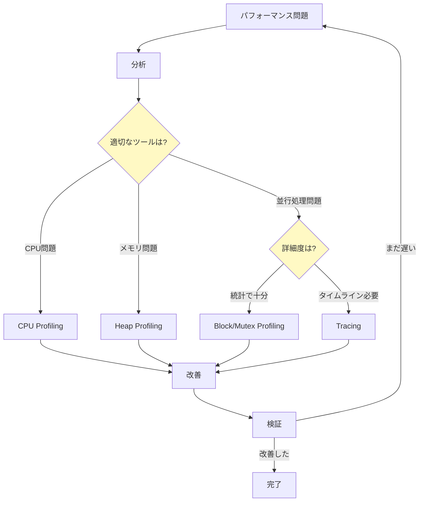
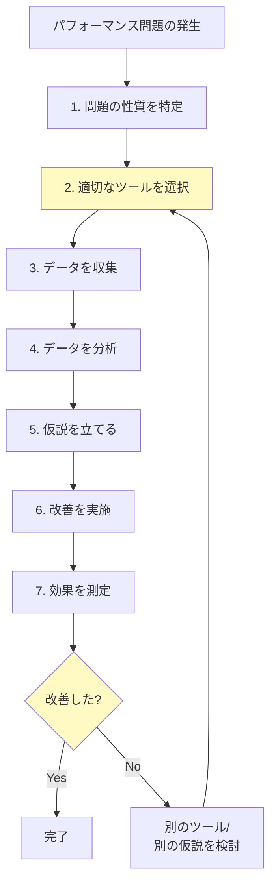
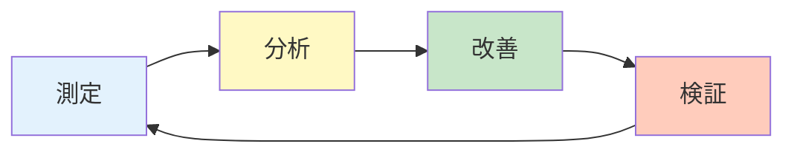

## ワークショップを振り返って

このワークショップでは、GoのProfilingとTracingについて、以下の内容を学習しました：

### Part 1: Profiling

- **CPU Profiling**: CPUボトルネックの特定と最適化
- **Heap Profiling**: メモリリークの検出とアロケーション削減
- **Goroutine Profiling**: Goroutineリークの検出
- **Block & Mutex Profiling**: 並行処理のボトルネック特定

### Part 2: Tracing

- **Trace Basics**: タイムラインでの実行状態の可視化
- **Task & Region**: User-definedアノテーションによるカスタマイズ
- **Flight Recorder**: 本番環境での常時記録

### Part 3: 比較とまとめ

- **ProfilingとTraceの使い分け**: それぞれの得意分野と限界
- **本番運用のTips**: 本番環境での計装と継続的改善

---

## 重要なメッセージ

### 「銀の弾丸」は存在しない

このワークショップで紹介した手法は、**あくまで一例**です。



**全ての問題に対して、常に同じツールを使えば良いわけではありません。**

---

## それぞれの計装のメリットとデメリット

### Profilingのメリット・デメリット

#### メリット

✓ **オーバーヘッドが低い**: 本番環境で常時有効化可能（1-5%）
✓ **ファイルサイズが小さい**: 長時間の記録が可能
✓ **統計情報**: 関数レベルのボトルネックを定量的に把握
✓ **学習コストが低い**: CLIやWebビューアで直感的に分析

#### デメリット

✗ **サンプリングベース**: 短時間の処理は捉えにくい
✗ **時系列情報がない**: いつ何が起きたか分からない
✗ **Goroutine間の関係**: 複数Goroutineにまたがる処理を追跡できない

### Tracingのメリット・デメリット

#### メリット

✓ **完全な可視化**: 全てのイベントを時系列で記録
✓ **タイムライン**: いつ何が起きたか一目瞭然
✓ **Goroutine追跡**: 並行処理の挙動を詳細に分析
✓ **GC可視化**: GCの影響を直接確認

#### デメリット

✗ **オーバーヘッドが高い**: 実行速度が10-30%低下
✗ **ファイルサイズが大きい**: 長時間の記録は現実的でない
✗ **CPU/メモリ詳細**: Profilingほど詳細な情報は得られない
✗ **学習コスト**: View traceの読み方に慣れが必要

---

## それぞれで得られるデータ

### Profilingで得られるデータ

```
✓ どの関数がCPU時間を消費しているか
✓ どこでメモリを割り当てているか
✓ Goroutine数とスタックトレース
✓ ブロッキングの累積時間
✓ Mutex競合の累積時間

✗ いつ実行されたか（時系列）
✗ Goroutine間の因果関係
✗ GCの発生タイミングと影響
```

### Tracingで得られるデータ

```
✓ Goroutineの生成・実行・ブロック・終了のタイムライン
✓ いつブロックされたか
✓ GCの発生タイミングとSTW（Stop-The-World）の影響
✓ Processor（P）の利用状況
✓ 複数Goroutineにまたがる処理の追跡

✗ 関数ごとのCPU使用率
✗ メモリ割り当て量の詳細
✗ 統計的な集計データ
```

---

## ツール選択の指針

### 何を知ることが肝要か

パフォーマンス問題を解決するために最も重要なのは、**各ツールの特性を理解すること**です：

1. **それぞれのツールで何が得られるか**
   - Profilingは統計、Tracingはタイムライン

2. **それぞれのツールで何が得られないか**
   - Profilingは時系列、Tracingは関数レベルの詳細

3. **計装することのコスト**
   - オーバーヘッド、ファイルサイズ、学習コスト

4. **問題の性質**
   - CPU/メモリ問題 → Profiling
   - 並行処理問題 → Tracing（またはProfiling）

### 推奨アプローチ



**ツールを使うこと自体が目的ではなく、問題を解決することが目的です。**

---

## 継続的な学習のために

### 実践で学ぶ

このワークショップで学んだ知識は、**実際のプロジェクトで使ってこそ身につきます**。

#### おすすめの実践方法

1. **既存プロジェクトにpprofを導入**
   - まずはnet/http/pprofを有効化
   - 定期的にプロファイルを取得
   - ベースラインを作成

2. **ベンチマークを書く**
   - 重要な処理のベンチマーク
   - `-cpuprofile`と`-memprofile`で分析
   - 改善前後を比較

3. **本番環境でプロファイリング**
   - 開発環境と本番環境の差を確認
   - 実際の負荷での挙動を観察

4. **問題発生時にFlight Recorderを活用**
   - 再現困難な問題を捉える
   - トレーススナップショットを保存

### コミュニティ

Goのパフォーマンスチューニングについて、以下のコミュニティで学び続けることができます：

#### オンラインリソース

- [Go Performance Optimization Guide](https://goperf.dev/)
- [golang-nuts メーリングリスト](https://groups.google.com/g/golang-nuts)
- [r/golang](https://www.reddit.com/r/golang/)

#### カンファレンス

- [GopherCon](https://www.gophercon.com/)
- [Go Conference](https://gocon.jp/)
- [dotGo](https://www.dotgo.eu/)

#### オープンソースプロジェクト

実際のGoプロジェクトでプロファイリングがどのように使われているかを見るのも有効です：

- [Prometheus](https://github.com/prometheus/prometheus) - メトリクス収集
- [etcd](https://github.com/etcd-io/etcd) - 分散KVS
- [Kubernetes](https://github.com/kubernetes/kubernetes) - コンテナオーケストレーション

---

## 最後に

パフォーマンスチューニングは、**測定・分析・改善・検証**のサイクルを繰り返すプロセスです。



### 覚えておいてほしいこと

1. **まず測定する**: 憶測ではなくデータに基づいて判断
2. **適切なツールを選ぶ**: 問題の性質に応じてProfilingとTracingを使い分ける
3. **小さく始める**: 一度に全てを最適化しようとしない
4. **効果を検証する**: 改善前後を必ず比較
5. **継続する**: パフォーマンスチューニングは一度で終わりではない

## 学びの共有をしてみましょう

他の方の発表や記事、ツイートなどに助けられた経験のある方も多いのではないでしょうか？  

せっかくの現地ワークショップなので、同期的なコミュニケーションを大事にしてみましょう！

- ✓ うまく行ったことを共有してみる
- ✓ 詰まったことも言葉にしてみる
- ✓ 他の参加者の気づきに耳を傾けてみる
- ✓ 疑問に思ったことを質問してみる

これらを通して、あなたや他の参加者の理解がより深まるかもしれません。


### このワークショップが役立つことを願って

今回学んだ知識が、皆さんのGoアプリケーション開発に役立つことを願っています。

パフォーマンス問題に直面したとき、このドキュメントを参照し、適切なツールを選択して、データドリブンな最適化を実践してください。

---

**Happy profiling, and happy coding!** 🚀

---

## フィードバック

このワークショップについてのフィードバックや質問があれば、以下のチャンネルでお気軽にご連絡ください：

- GitHub Issues: [gwc-profiling](https://github.com/task4233/gwc-profiling/issues)
- Twitter/X: [@task4233](https://twitter.com/task4233)

皆さんの学びが、より良いGoアプリケーションの開発につながることを期待しています！
